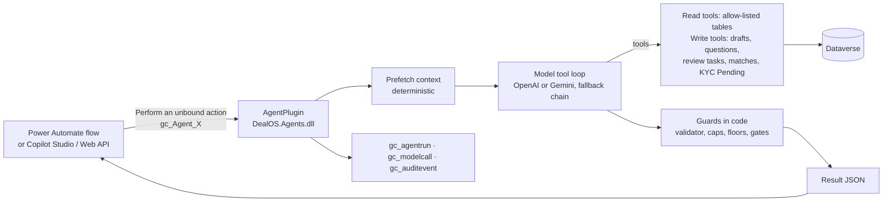

# DealOS Agents

**As of:** 7 October 2026
**Environment:** Giga core's Environment (Dev), solution `DealOS`
**AI provider:** OpenAI since 7 Oct 2026 (`gpt-5.4-mini` through the Responses API, fallback `gpt-4.1-mini`). Gemini is still supported: `python3 tools/deploy_agents.py --provider gemini|openai` switches.

There are **8 agents**, each deployed as a Dataverse Custom API named `gc_Agent_<Name>`: the two email desk agents (**Mail Triage**, **Trade Desk**) and the six back-office agents a desk deal goes through (documents, KYB, compliance, contract, daily digest). A Power Automate flow (or any Web API client) calls an agent the same way it calls any other Dataverse action. The website's chat agents and the marketplace-only agents (listing verification, matching, pricing, negotiation, payment/escrow, logistics) were removed on 7 Oct 2026; their code is in git history (commit `c55f3bb`). Each agent:

1. **Pre-loads its data with code:** email threads, documents, parties, deals and rules.
2. **Asks the model to reason** within a strict instruction set and a limited tool set.
3. **Writes only drafts, ledger rows and review tasks.**
4. **Applies code guards to the result** before returning it.

Evidence status, money, stage changes and approvals stay in code and with humans.



---

## Agent catalogue

| Agent (Custom API) | SubjectId points at | What it does | What it can write | Human gate |
|---|---|---|---|---|
| `gc_Agent_DocumentIntelligence` | `gc_document` | Reads the attached PDF or image, classifies it, and extracts printed values with page and verbatim quote. Flags prompt injection. Then re-resolves evidence. | `gc_assertion` rows, document type and risk flags | — (assertions are only evidence) |
| `gc_Agent_OnboardingKYB` | `account` | Seller/party KYB: company, UBO, IDs, address, authority to sell, screening. | `gc_kyccheck` (Pending or Refer only), questions, draft request, review tasks | Tier Upgrade, Screening Clearance |
| `gc_Agent_BuyerVerification` | `account` | Buyer KYB, including proof of funds or bank reference. | Same as KYB | Same as KYB |
| `gc_Agent_Compliance` | `gc_deal` | Pre-contract gate: tiers, screening, FATF and CAHRA, controlled commodities, permits. Returns Clear / Refer / Block. | `gc_reviewtask` | Screening Clearance (whenever not Clear) |
| `gc_Agent_Contract` | `gc_deal` | Builds a term sheet strictly from the accepted offer and evidence. Refuses to draft while critical terms are missing. | `gc_contract` (Draft), `gc_reviewtask` | Contract Issue |
| `gc_Agent_AdminSupervisor` | — (no subject) | Daily ops digest: approvals, stuck deals, failures, AI spend (sent as a desk briefing). | Nothing (read-only) | — |
| `gc_Agent_MailTriage` | `gc_message` | Email Desk: classifies a received email (Buyer Requirement, Offer To Sell, Thread Reply, Documents, Vendor Pitch, Scam, Not Trade), scores genuineness 0–100 and extracts the requirement or offer. Reads up to 2 attached PDFs/images. **The verdict (Genuine / Review / Ignored) is decided in code** from the score plus hard signals: failed DMARC/SPF+DKIM, dangerous attachments, link shorteners and Reply-To redirection. A known sender or a thread we wrote in is never Ignored, and prompt injection is never Genuine. The owner's latest label corrections in Gmail are shown to it as examples. See [EMAIL_DESK.md](EMAIL_DESK.md). | Triage columns on `gc_message` and `gc_conversation` | — (labels only; nothing is sent) |
| `gc_Agent_TradeDesk` | `gc_conversation` (an email thread) | Email Desk: works a genuine email like a trader in the middle (back to back). **Buyer thread:** saves the requirement, starts sourcing, quotes our price, records the buyer's price proposal, records acceptance. **Seller thread:** records the quote, decline or acceptance of our bid. **Sellers take turns:** the first seller to quote is negotiated with the buyer; later ones are queued, and the next comes up when the deal breaks (`buyer_rejects_offer`, a seller withdrawing). The buyer side only sees the active seller's quote. **Seller first (unsolicited offer, "we need buyers"):** with a price and quantity, saves a **seller lot** (`save_seller_lot`) with the window the seller wrote (`window_hours`, or `open_ended` for "until sold"; otherwise the default). It is offered to matching buyers. Otherwise it saves a seller lead. **Lot bids:** on a lot, `buyer_accepts` / `record_buyer_price` record a bid (any price, even above ours). On a timed lot the bid waits for the deadline; on an open-ended lot it goes to the seller at once as our bid (buyer price − margin). **Lot seller thread:** `seller_closes_lot` when the seller accepts a bid price (winners → Confirm deal, confirmations drafted by the tool) or withdraws; a new price is a counter (`save_seller_lot` again) that goes to the buyers. `buyer_declines_lot` when a buyer is not interested. **Signed contract:** opens a check task. **KYB documents** from a party: `save_kyb_documents` files them on the company and starts the KYB agents (a person approves the tier). **After signing:** `record_shipment_update` records loading, sailing, arrival or delivery; the masked update to the other side is drafted by code. **Company profile:** attached with `draft_email attach=company_profile` when one is on file (`tools/company_profile.py`). It drafts every reply. The margin maths are in code (`Desk.PriceToBuyer` / `BidToSeller`), and the buyer side never sees supplier names or prices. `draft_email` refuses the other party's name, email, domain or price, our margin, contact details, links and bank details. See [EMAIL_DESK.md](EMAIL_DESK.md). | `gc_buyerrequirement`, buyer account and contact, `gc_lead`, `gc_offer`, invites, deals and seller threads (via sourcing), draft `gc_message`s, review tasks | **Confirm deal** (acceptance never binds by itself); **Signed contract received**; every email is sent by a person from Gmail |

---

## Calling an agent

**Inputs** (the same for every agent):

| Name | Type | Required | Meaning |
|---|---|---|---|
| `SubjectId` | String (GUID) | Yes, except AdminSupervisor | The record the agent works on |
| `Input` | String (JSON object) | No | Extra data, e.g. `{"perspective":"buyer","limits":{"max_price":8800,"preferred_payment_terms":["LC Sight"]}}` for Negotiation, or cost inputs for Pricing |
| `DryRun` | Boolean | No | `true` = full reasoning, but no records written; actions are listed in the result |

**Outputs:**

| Name | Type | Meaning |
|---|---|---|
| `AgentRunId` | String | The `gc_agentrun` record for this run |
| `Status` | String | `Succeeded` or `Failed` |
| `Summary` | String | 2–3 sentences for a human |
| `NeedsHuman` | Boolean | `true` when a person must act before the process continues |
| `Result` | String (JSON) | `{agent, run_id, status, model, steps, tokens_in, tokens_out, seconds, error, result, actions}`. `result` follows the agent's schema; `actions` lists every write. |

**From Power Automate:** use the Dataverse connector action **Perform an unbound action**. Pick `gc_Agent_<Name>`, map `SubjectId` from the trigger, then use **Parse JSON** on `Result` (schemas are in `build/agents/<Name>.output.json` after running the harness). Branch on `Status` and `NeedsHuman`.

**From the command line (dev):**

```bash
python3 tools/run_agent.py TradeDesk <conversation-guid> --dry --input '{"message_id":"<gc_message guid>"}'
python3 tools/run_agent.py Compliance <deal-guid> --dry
```

---

## Guardrails enforced in code (not by the prompt)

| Guard | Where | Effect |
|---|---|---|
| Evidence status is never set by AI | `gc_ResolveEvidence` | Agents create assertions. Only the resolver computes Verified / Documented / Claimed / Conflicting. |
| Message validator | `draft_message` | Rejects any number not in the data shown to the agent. Rejects confidential terms (seller name, contacts, asset name, Internal/Restricted facts) in market messages, and emails or phone numbers. Rejects "verified" with no Verified fact, and Claimed values without hedging ("seller states…"). |
| Do not ask twice | `ask_question` | Refuses values that are already Documented or Verified, or already given (Claimed → ask for evidence instead). Refuses repeats within the cool-down (`questions.cooldown_hours`). Limits outstanding questions to `dd1.max_asks` per counterparty. |
| One pending draft | `draft_message` | No new draft while one of the same kind is waiting for approval |
| `finish` timing | Runtime | `finish` is not accepted in the same turn as other tool calls, so the agent has seen its tool results before it reports |
| Facts in the result | `AfterFinish` | "drafted" and "asks" fields are set from the actions actually taken |
| Tier cap | KYB `AfterFinish` | The recommended tier can never exceed what recorded checks and screening support. Trade Verified / Trusted are never recommended by an agent. |
| Compliance floor | Compliance `AfterFinish` | Confirmed match → Block. Potential/missing screening, hold or low tier → at least Refer. Any non-Clear result opens a review task. |
| Money gate | Payment `AfterFinish` | A Fund Release task opens only when the mapped milestones are Verified (or Completed with an evidence document) and no overlay is active. Agents never release money. |
| Engine numbers | Pricing `AfterFinish` | Landed cost and net payout are overwritten with the values in `gc_pricequote` |
| Negotiation limits | Negotiation `AfterFinish` | The counter price is clamped to your min/max. An invented Incoterm or payment term is removed. A reply with unknown numbers or party names is dropped. |
| System-owned approvals | `create_review_task` | The model can't open Listing Publish, Tier Upgrade, Fund Release, Contract Issue or Message Send. Code opens these with structured payloads, which the Review decisions flow applies; Tier Upgrade carries `tier`/`tierValue` |
| Caller-only cost inputs | `calculate_price_quote` | Re-pricing uses only the cost inputs in the caller's `Input`, never values the model supplies; it is refused when there are none |
| Prompt injection | All | Documents and messages are wrapped as data. Injection is flagged. No tool can change a status, publish, approve or pay. |
| Transaction safety | Tools | Model-supplied GUIDs and columns are validated before any Dataverse call. A failing call stops the run with a clear error, because Dataverse rolls back the whole plug-in transaction. |
| Least data | Read tools | Each agent has a table allow-list. `gc_secret` is never readable. Reads run as the calling user (security roles apply). |

---

## Configuration (`gc_platformsetting`)

| Key | Default | Meaning |
|---|---|---|
| `agents.provider` | `openai` | `openai` or `gemini` |
| `agents.openai.model.default` | `gpt-5.4-mini` | OpenAI model for all agents |
| `agents.openai.model.document` / `.discovery` | `gpt-5.4-mini` | Document Intelligence / web discovery of sellers and buyers (`web_search` tool) |
| `agents.openai.model.fallbacks` | `gpt-4.1-mini` | Tried in order on 429, 503, 404 or timeout |
| `agents.openai.reasoning_effort` | `low` | For gpt-5 / o-series models |
| `agents.model.default`, `.document`, `.fallbacks` | `gemini-3.5-flash`, ... | The same, when the provider is Gemini; the whole chain is retried once after a pause |
| `agents.time_budget_seconds` | `100` | Per run (the Dataverse plug-in limit is 120 s) |
| `agents.call_timeout_seconds` | `45` | Per model call (web discovery: 80 s) |
| `agents.pricing` | `{}` | USD per 1M tokens per model prefix, so `gc_modelcall.gc_costusd` is filled |
| `agents.generation_config` | (empty) | Extra `generationConfig` merged into every call (temperature, maxOutputTokens; Gemini-only keys are ignored by OpenAI) |
| `dd1.max_asks`, `questions.cooldown_hours`, `evidence.extraction_threshold` | existing | Reused by the agents |

**The API keys** are stored in `gc_secret` (`openai.api_key`, `gemini.api_key`; from `.env` `OPENAI_API_KEY` / `GEMINI_API_KEY` by `deploy_agents.py`). That table is organisation-owned, has no privileges for user roles, and is read only by the plug-in as SYSTEM. It is never in the repo; locally it lives in `.env`, which git ignores.

---

## Developer workflow

```bash
export DOTNET_ROOT=/opt/homebrew/opt/dotnet/libexec
dotnet build -c Release src/DealOS.Agents                              # plug-in (net462, signed)
dotnet run --project tests/DealOS.Agents.Harness -- build/agents       # offline checks + manifest + schemas
python3 tools/deploy_agents.py                                         # idempotent deploy into the DealOS solution
python3 tools/run_agent.py AdminSupervisor                             # run an agent
python3 tools/seed_test_data.py cleanup                                # remove [AGENT-TEST] documents
pac solution export --name DealOS --path /tmp/DealOS.zip && pac solution unpack --zipfile /tmp/DealOS.zip --folder solutions/DealOS --packagetype Unmanaged --allowDelete true
```

The first time, `python3 tools/dv.py login` opens a browser sign-in. The token is cached in `.dv_token.json`, which git ignores.

---

## Test results (6 Oct 2026, Dev, smoke-test data)

| Agent | Mode | Outcome |
|---|---|---|
| AdminSupervisor | live | Correct digest from live data. 23 s, 6 steps. |
| DocumentIntelligence | dry, injection PDF | `injection_detected = true` and a `prompt_injection` flag. Literal values only, nothing marked verified. |
| DocumentIntelligence | live, clean COA | 5 assertions with page and quote. The resolver moved them to Documented. 10.5 s. |
| Compliance | dry | Refer: parties not KYB-verified and not screened. Review task. |
| Contract | dry | Refused to draft: price, Incoterm and payment terms missing on the deal |
| OnboardingKYB / BuyerVerification | dry | Pending checks recorded, 3 asks maximum, tier stays Unverified |

---

## Known limits and next steps

1. **The provider is OpenAI** (7 Oct 2026), replacing the Gemini free tier (5 requests a minute, no web search). The OpenAI client (`Infrastructure/ModelClient.cs`) translates the runtime's requests to the Responses API with `store=false`: nothing is kept at OpenAI, and reasoning is passed between tool calls encrypted.
2. **Rotate the API keys.** Both the OpenAI and the Gemini key were pasted into a chat. Put the new key in `.env` and run `python3 tools/deploy_agents.py` to store it.
3. **Plug-in limits:** each run gets at most about 100 seconds. Documents are limited to 14 MB, and only PDF, image or text files are supported (convert DOCX/XLSX first).
4. **Workflows are built.** 22 flows and the operations APIs compose these agents along the desk's deal path; see [WORKFLOWS.md](WORKFLOWS.md).
