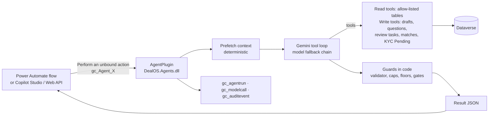

# DealOS Agents

**As of:** 6 October 2026
**Environment:** Giga core's Environment (Dev), solution `DealOS`
**AI provider:** Google Gemini (default `gemini-3.5-flash`, with fallbacks)

There are **16 agents**, each deployed as a Dataverse Custom API named `gc_Agent_<Name>`. Twelve are back-office specialists; two (**Buyer Concierge** and **Seller Assistant**) are the chat agents people talk to on the marketplace site. A Power Automate flow (or Copilot Studio, Power Pages, or any Web API client) calls an agent the same way it calls any other Dataverse action. Each agent:

1. **Pre-loads its data with code:** listings, facts, documents, parties and rules.
2. **Asks Gemini to reason** within a strict instruction set and a limited tool set.
3. **Writes only drafts, ledger rows and review tasks.**
4. **Applies code guards to the result** before returning it.

Evidence status, money, stage changes and approvals stay in code and with humans.



---

## Agent catalogue

| Agent (Custom API) | SubjectId points at | What it does | What it can write | Human gate |
|---|---|---|---|---|
| `gc_Agent_DocumentIntelligence` | `gc_document` | Reads the attached PDF or image, classifies it, and extracts printed values with page and verbatim quote. Flags prompt injection. Then re-resolves evidence. | `gc_assertion` rows, document type and risk flags | — (assertions are only evidence) |
| `gc_Agent_ListingVerification` (DD1) | `gc_listing` | Reviews evidence. Asks the seller only for blocking gaps, never twice. Drafts an anonymous market teaser and a seller request. Recommends Publish / Needs Info / Hold / Reject. | `gc_question`, `gc_factsheet`, `gc_generatedmessage` (Draft), `gc_reviewtask` | Message Send, Listing Publish |
| `gc_Agent_OnboardingKYB` | `account` | Seller/party KYB: company, UBO, IDs, address, authority to sell, screening. | `gc_kyccheck` (Pending or Refer only), questions, draft request, review tasks | Tier Upgrade, Screening Clearance |
| `gc_Agent_BuyerVerification` | `account` | Buyer KYB, including proof of funds or bank reference. | Same as KYB | Same as KYB |
| `gc_Agent_Compliance` | `gc_deal` | Pre-contract gate: tiers, screening, FATF and CAHRA, controlled commodities, permits. Returns Clear / Refer / Block. | `gc_reviewtask` | Screening Clearance (whenever not Clear) |
| `gc_Agent_Matching` | `gc_buyerrequirement` | Scores published listings. Quantity, price, terms and trust are computed in code; the model judges spec fit only. | `gc_match` (Proposed, both opt-ins false) | Buyer and seller opt in |
| `gc_Agent_Pricing` | `gc_offer` | Explains landed cost (buyer) and net payout (seller). Numbers come only from `gc_CalculatePriceQuote`. Recalculates when cost inputs are given. | Price quotes (via the engine) | — |
| `gc_Agent_Negotiation` | `gc_offer` | Advises the buyer or seller: Accept / Counter / Reject / Wait / Need Info. Proposes a counter within your limits and drafts a reply. | Nothing (advice only) | The user clicks send |
| `gc_Agent_Contract` | `gc_deal` | Builds a term sheet strictly from the accepted offer and evidence. Refuses to draft while critical terms are missing. | `gc_contract` (Draft), `gc_reviewtask` | Contract Issue |
| `gc_Agent_Payment` | `gc_deal` | Plans the escrow tranches with commission (deterministic maths). Checks which releases have **verified** milestones. | `gc_reviewtask` (Fund Release, only when the code-checked milestones are verified) | Finance approves every release |
| `gc_Agent_Logistics` | `gc_deal` | Builds the corridor document checklist (domestic or international). Creates milestones, chases missing documents. | `gc_milestone`, draft chaser, `gc_reviewtask` | Shipment Booking |
| `gc_Agent_AdminSupervisor` | — (no subject) | Daily ops digest: approvals, stuck deals, listings waiting, failures, AI spend. | Nothing (read-only) | — |
| `gc_Agent_BuyerConcierge` | `gc_conversation` | Chat with a buyer: searches the masked catalog, explains evidence, shows the buyer's RFQs, matches, deals and offers (landed cost), drafts an RFQ. | `gc_buyerrequirement` (Draft), the reply `gc_message` | The buyer sends the RFQ from the site |
| `gc_Agent_MailTriage` | `gc_message` | Email Desk: classifies a received email (Buyer Requirement, Offer To Sell, Thread Reply, Documents, Vendor Pitch, Scam, Not Trade), scores genuineness 0–100 and extracts the requirement or offer. Reads up to 2 attached PDFs/images. **The verdict (Genuine / Review / Ignored) is decided in code** from the score plus hard signals: failed DMARC/SPF+DKIM, dangerous attachments, link shorteners and Reply-To redirection. A known sender or a thread we wrote in is never Ignored, and prompt injection is never Genuine. See [EMAIL_DESK.md](EMAIL_DESK.md). | Triage columns on `gc_message` and `gc_conversation` | — (labels only; nothing is sent) |
| `gc_Agent_TradeDesk` | `gc_conversation` (an email thread) | Email Desk: works a genuine email like a trader in the middle (back to back). **Buyer thread:** saves the requirement, starts sourcing, quotes our price, records the buyer's price proposal, records acceptance. **Seller thread:** records the quote, decline or acceptance of our bid. **Unsolicited offer:** saves a seller lead. **Signed contract:** opens a check task. It drafts every reply. The margin maths are in code (`Desk.PriceToBuyer` / `BidToSeller`), and the buyer side never sees supplier names or prices. `draft_email` refuses the other party's name, email, domain or price, our margin, contact details, links and bank details. See [EMAIL_DESK.md](EMAIL_DESK.md). | `gc_buyerrequirement`, buyer account and contact, `gc_lead`, `gc_offer`, invites, deals and seller threads (via sourcing), draft `gc_message`s, review tasks | **Confirm deal** (acceptance never binds by itself); **Signed contract received**; every email is sent by a person from Gmail |
| `gc_Agent_SellerAssistant` | `gc_conversation` | Chat with a seller: what each listing still needs, records the seller's answers to verification questions (as Claimed assertions), drafts a listing, explains invites, deals and net payouts. | `gc_listing` (Draft), `gc_assertion` + answered `gc_question`, the reply `gc_message` | The seller submits the listing from the site |

---

## Chat agents (Buyer Concierge, Seller Assistant)

**Trigger.** The `ChatPlugin` runs asynchronously on every `gc_message` created in a conversation, unless the message is the platform's own (`gc_isplatform`). It picks the agent from `gc_conversation.gc_assistant` (otherwise from the account's roles), runs it with `{"message_id": …}`, and the agent writes its reply as a platform `gc_message` with up to 3 suggested next steps in `gc_attachments`. If the run fails, a short apology is posted instead. The website polls the conversation for the reply.

**Identity.** The person is the conversation's company (`gc_counterparty`). On the site the portal guard sets that company, so a user can only chat as their own company. Every chat tool filters by that account in code. Another party's records are reachable only as the published, masked catalog: no seller, asset, listing title or location.

**Guards, in code:**

| Guard | Effect |
|---|---|
| Reply validator (`CheckFinish`) | Before the reply is accepted, it is checked like a drafted message. Numbers must appear in the data or the user's own messages, and counterparty names must not appear. For the buyer it also checks evidence wording: no "verified" without a Verified fact, and seller-claimed values must be hedged. A rejected reply goes back to the model to rewrite. |
| Drafts only | `draft_rfq` and `draft_listing` create Draft records; the user sends or submits them on the site. At most 5 drafts per company per 24 hours. |
| User-stated prices only | A target or ask price is accepted only if the user typed that number. |
| Verbatim answers | `record_answer` stores only text copied from the latest message. It becomes a Claimed assertion (source Message), the question is linked, and evidence is re-resolved. |
| Rate limit | `chat.max_messages_per_hour` (30) per conversation; above it a notice is posted and no model runs. |
| Sender check | A message whose sender contact belongs to another company is not answered. |

**Try it from the terminal:**

```bash
python3 tools/chat.py new <account-guid> buyer          # prints a conversation id ([AGENT-TEST])
python3 tools/chat.py say <conversation-guid> "Need 250 MT copper cathode, FOB. What do you have?"
python3 tools/chat.py show <conversation-guid>
```

---

## Calling an agent

**Inputs** (the same for every agent):

| Name | Type | Required | Meaning |
|---|---|---|---|
| `SubjectId` | String (GUID) | Yes, except AdminSupervisor | The record the agent works on |
| `Input` | String (JSON object) | No | Extra data, e.g. `{"perspective":"buyer","limits":{"max_price":8800,"preferred_payment_terms":["LC Sight"]}}` for Negotiation, or cost inputs for Pricing |
| `DryRun` | Boolean | No | `true` = full reasoning, but no records written; actions are listed in the result |

**Outputs:**

| Name | Type | Meaning |
|---|---|---|
| `AgentRunId` | String | The `gc_agentrun` record for this run |
| `Status` | String | `Succeeded` or `Failed` |
| `Summary` | String | 2–3 sentences for a human |
| `NeedsHuman` | Boolean | `true` when a person must act before the process continues |
| `Result` | String (JSON) | `{agent, run_id, status, model, steps, tokens_in, tokens_out, seconds, error, result, actions}`. `result` follows the agent's schema; `actions` lists every write. |

**From Power Automate:** use the Dataverse connector action **Perform an unbound action**. Pick `gc_Agent_<Name>`, map `SubjectId` from the trigger, then use **Parse JSON** on `Result` (schemas are in `build/agents/<Name>.output.json` after running the harness). Branch on `Status` and `NeedsHuman`.

**From the command line (dev):**

```bash
python3 tools/run_agent.py ListingVerification <listing-guid> --dry
python3 tools/run_agent.py Negotiation <offer-guid> --input '{"perspective":"buyer","limits":{"max_price":8800}}'
```

---

## Guardrails enforced in code (not by the prompt)

| Guard | Where | Effect |
|---|---|---|
| Evidence status is never set by AI | `gc_ResolveEvidence` | Agents create assertions. Only the resolver computes Verified / Documented / Claimed / Conflicting. |
| Message validator | `draft_message` | Rejects any number not in the data shown to the agent. Rejects confidential terms (seller name, contacts, asset name, Internal/Restricted facts) in market messages, and emails or phone numbers. Rejects "verified" with no Verified fact, and Claimed values without hedging ("seller states…"). |
| Do not ask twice | `ask_question` | Refuses values that are already Documented or Verified, or already given (Claimed → ask for evidence instead). Refuses repeats within the cool-down (`questions.cooldown_hours`). Limits outstanding questions to `dd1.max_asks` per counterparty. |
| One pending draft | `draft_message` | No new draft while one of the same kind is waiting for approval |
| `finish` timing | Runtime | `finish` is not accepted in the same turn as other tool calls, so the agent has seen its tool results before it reports |
| Facts in the result | `AfterFinish` | "drafted" and "asks" fields are set from the actions actually taken |
| Tier cap | KYB `AfterFinish` | The recommended tier can never exceed what recorded checks and screening support. Trade Verified / Trusted are never recommended by an agent. |
| Compliance floor | Compliance `AfterFinish` | Confirmed match → Block. Potential/missing screening, hold or low tier → at least Refer. Any non-Clear result opens a review task. |
| Money gate | Payment `AfterFinish` | A Fund Release task opens only when the mapped milestones are Verified (or Completed with an evidence document) and no overlay is active. Agents never release money. |
| Engine numbers | Pricing `AfterFinish` | Landed cost and net payout are overwritten with the values in `gc_pricequote` |
| Negotiation limits | Negotiation `AfterFinish` | The counter price is clamped to your min/max. An invented Incoterm or payment term is removed. A reply with unknown numbers or party names is dropped. |
| Risk-flag floor | ListingVerification `AfterFinish` | A listing with any risk-flagged document (prompt injection, tampering) is raised to **Hold** |
| System-owned approvals | `create_review_task` | The model can't open Listing Publish, Tier Upgrade, Fund Release, Contract Issue or Message Send. Code opens these with structured payloads, which the Review decisions flow applies; Tier Upgrade carries `tier`/`tierValue` |
| Caller-only cost inputs | `calculate_price_quote` | Re-pricing uses only the cost inputs in the caller's `Input`, never values the model supplies; it is refused when there are none |
| Prompt injection | All | Documents and messages are wrapped as data. Injection is flagged. No tool can change a status, publish, approve or pay. |
| Transaction safety | Tools | Model-supplied GUIDs and columns are validated before any Dataverse call. A failing call stops the run with a clear error, because Dataverse rolls back the whole plug-in transaction. |
| Least data | Read tools | Each agent has a table allow-list. `gc_secret` is never readable. Reads run as the calling user (security roles apply). |

---

## Configuration (`gc_platformsetting`)

| Key | Default | Meaning |
|---|---|---|
| `agents.model.default` | `gemini-3.5-flash` | Model for all agents |
| `agents.model.document` | `gemini-3.5-flash` | Model for Document Intelligence |
| `agents.model.fallbacks` | `gemini-3.1-flash-lite,gemini-3.8-flash` | Tried in order on 429, 503, 404 or timeout; the whole chain is retried once after a pause |
| `agents.time_budget_seconds` | `100` | Per run (the Dataverse plug-in limit is 120 s) |
| `agents.call_timeout_seconds` | `45` | Per Gemini call |
| `agents.pricing` | `{}` | USD per 1M tokens per model prefix, so `gc_modelcall.gc_costusd` is filled |
| `agents.generation_config` | (empty) | Extra Gemini `generationConfig` (e.g. thinking settings) |
| `chat.max_messages_per_hour` | `30` | User messages per conversation per hour the chat agents answer |
| `chat.history_messages` | `12` | Earlier messages given to a chat agent as context |
| `dd1.max_asks`, `questions.cooldown_hours`, `evidence.extraction_threshold` | existing | Reused by the agents |

**The Gemini key** is stored in `gc_secret` (`gemini.api_key`). That table is organisation-owned, has no privileges for user roles, and is read only by the plug-in as SYSTEM. It is never in the repo; locally it lives in `.env`, which git ignores.

---

## Developer workflow

```bash
export DOTNET_ROOT=/opt/homebrew/opt/dotnet/libexec
dotnet build -c Release src/DealOS.Agents                              # plug-in (net462, signed)
dotnet run --project tests/DealOS.Agents.Harness -- build/agents       # offline checks + manifest + schemas
python3 tools/deploy_agents.py                                         # idempotent deploy into the DealOS solution
python3 tools/run_agent.py AdminSupervisor                             # run an agent
python3 tools/seed_test_data.py docs <listing-guid>                    # test PDFs (clean COA + injection COA)
python3 tools/seed_test_data.py cleanup                                # remove [AGENT-TEST] documents
pac solution export --name DealOS --path /tmp/DealOS.zip && pac solution unpack --zipfile /tmp/DealOS.zip --folder solutions/DealOS --packagetype Unmanaged --allowDelete true
```

The first time, `python3 tools/dv.py login` opens a browser sign-in. The token is cached in `.dv_token.json`, which git ignores.

---

## Test results (6 Oct 2026, Dev, smoke-test data)

| Agent | Mode | Outcome |
|---|---|---|
| AdminSupervisor | live | Correct digest from live data. 23 s, 6 steps. |
| DocumentIntelligence | dry, injection PDF | `injection_detected = true` and a `prompt_injection` flag. Literal values only, nothing marked verified. |
| DocumentIntelligence | live, clean COA | 5 assertions with page and quote. The resolver moved them to Documented. 10.5 s. |
| ListingVerification | live | 3 blocking asks, a seller request and an anonymous teaser (Documented values only, no seller identity), both queued for approval. Re-run: no new asks while 3 are outstanding. |
| Negotiation | dry | Counter at the buyer's max (8,800). Keeps FOB from the offer. Asks for payment terms instead of inventing them. |
| Pricing | dry | Explanation grounded in the engine quote: landed cost 4,628,223.99, net payout 4,432,500 USD |
| Compliance | dry | Refer: parties not KYB-verified and not screened. Review task. |
| Contract | dry | Refused to draft: price, Incoterm and payment terms missing on the deal |
| Payment | dry | 30/70 schedule with 1.5% commission from the plan, computed by the tool. Blocker: not funded. |
| Logistics | dry | International checklist (South Africa → Germany). Waits for Funded before acting. |
| OnboardingKYB / BuyerVerification | dry | Pending checks recorded, 3 asks maximum, tier stays Unverified |
| Matching | dry | One candidate proposed, score 68, explained (S level unknown) |
| BuyerConcierge | live, via a chat message | Found the one copper listing without naming the seller, said its facts are only claimed, explained escrow and inspection. 39 s. |
| BuyerConcierge | live | Drafted the RFQ the buyer described (250 MT, target 8800 USD, Hamburg, inspection) as Draft. 26 s. |
| SellerAssistant | live | Listed what the draft listing still needs (12 missing facts, 3 open questions). |
| SellerAssistant | live | Recorded "ML-2024-0457" as the answer to the mining-licence question: Claimed assertion, question answered, fact Claimed. 30 s. |

---

## Known limits and next steps

1. **The Gemini key is on the free tier.** The limit is 5 requests per minute per model, and the free models frequently return "high demand" 503s. In testing, one run failed after every model in the chain was busy. **Enable billing on the Google AI Studio project before real use.** Also check Google's Gemini API terms on how free-tier content may be used, before sending real deal documents.
2. **Rotate the API key.** It was pasted into a chat. After you switch to a paid key, run `python3 tools/deploy_agents.py` to store the new one.
3. **Plug-in limits:** each run gets at most about 100 seconds. Documents are limited to 14 MB, and only PDF, image or text files are supported (convert DOCX/XLSX first).
4. **Workflows are built.** 22 flows and 4 operations APIs compose these agents across the whole trade; see [WORKFLOWS.md](WORKFLOWS.md).
5. **Front-door chat agents are built** as `gc_Agent_BuyerConcierge` and `gc_Agent_SellerAssistant` on this runtime (decided 6 Oct 2026 instead of Copilot Studio, to avoid paying Copilot credits on top of Gemini). WhatsApp can later post into the same `gc_message` table through a flow.
