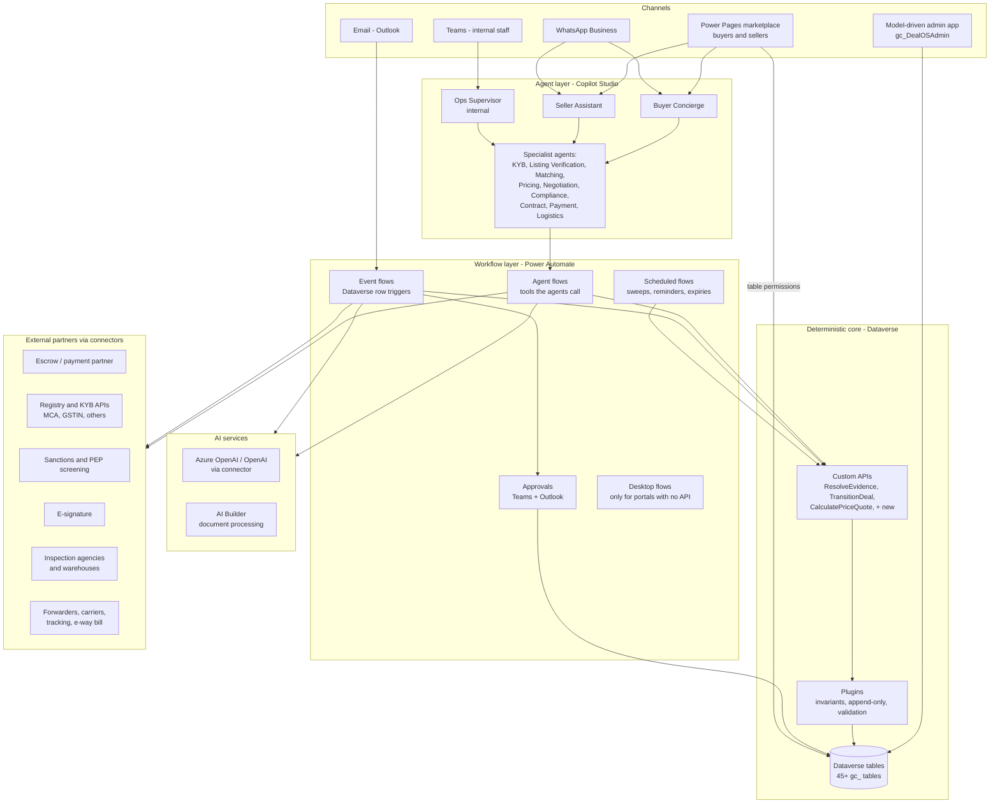
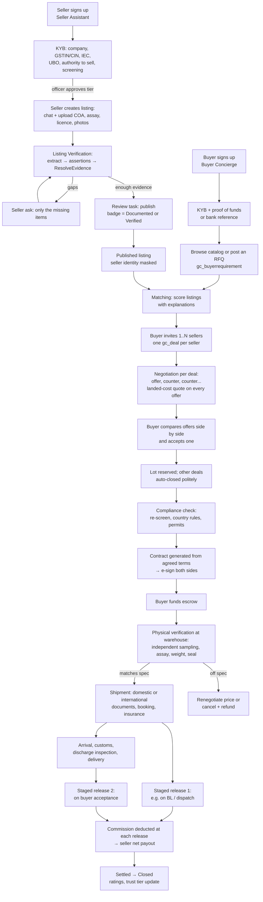
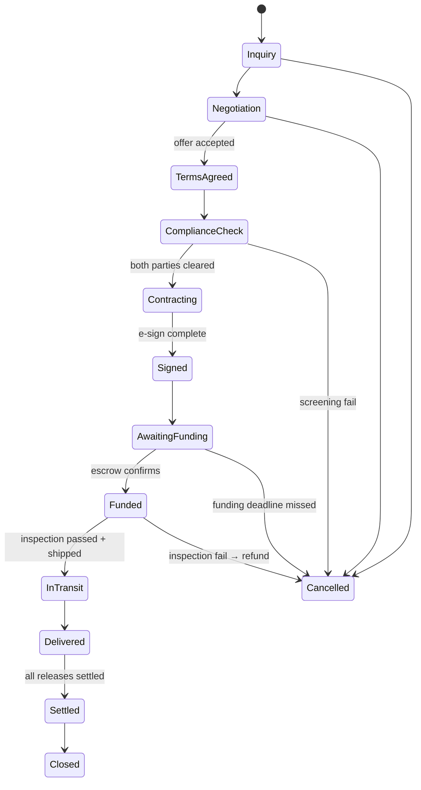
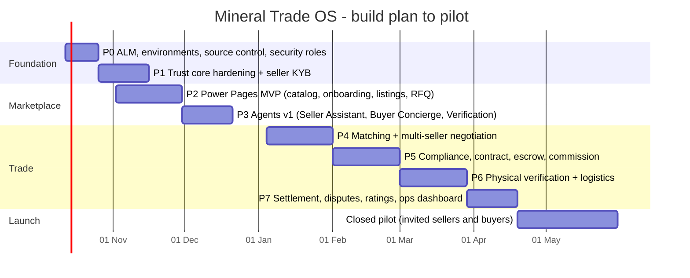

# Mineral Trade OS: Architecture and Build Plan (Power Platform)

**As of:** 6 October 2026
**Platform:** Microsoft Power Platform: Dataverse, Power Automate, Copilot Studio, Power Pages
**Environment:** Giga core's Environment (`org61da3071.crm8.dynamics.com`), solution `DealOS` 1.0.0.0
**Status:** Proposal for review before development starts

> **Update, 6 Oct 2026:**
> - **AI provider:** decided as **Google Gemini** (decision A3).
> - **Built:** 12 specialist agents, deployed to Dev as Dataverse Custom APIs `gc_Agent_*` in the `DealOS` solution. See [AGENTS.md](AGENTS.md).
> - **Next:** the Power Automate workflows that compose those agents, then the Copilot Studio front-door agents.

---

## 0. Summary

We are building an **agent-driven marketplace for trading rare earths and critical minerals**. Think IndiaMART or Amazon, but only for verified mineral trade. The difference is that the platform also runs the deal from start to finish.

- Sellers list material, and the platform **proves what they claim**.
- Buyers browse and send requests to **several sellers at once**, negotiate with each of them and choose one.
- Both sides are verified.
- The buyer pays into **escrow**.
- The goods are **physically inspected at a warehouse** before they ship.
- The platform runs **domestic or international shipment**.
- Money is released in stages, and **our commission is deducted at release**.

Users mostly deal with **AI agents** (on the website, WhatsApp and email), not with forms. Each agent works through **Power Automate workflows**, and those workflows write to **one Dataverse record of truth**. Humans approve anything sensitive.

**The foundation is already partly built.** The `DealOS` solution contains:

- 45 custom tables
- an evidence engine (assertions, facts, conflicts)
- three custom APIs (evidence resolution, deal stage transitions, landed-cost pricing)
- an invariants plugin that keeps the audit and evidence records append-only
- four flows
- an admin app

**Still to build:**

- the public marketplace site (Power Pages)
- the agents (Copilot Studio)
- negotiation with multiple sellers
- escrow, e-signature and commission
- physical inspection and logistics
- notifications
- ALM across Dev, Test and Prod

**Estimate:** about **7 months to a closed pilot** with a team of 2–3 people (section 17).

---

## 1. Problem statement: what we are building and why

### The problem

Rare-earth and critical-mineral trade, especially between small and mid-size players, runs on WhatsApp chains, PDF COAs and trust. Three problems block deals.

1. **Authenticity.** Buyers cannot tell real material from paper material. Forged COAs, assays and licences, and "mandates" with no authority to sell, are common. Most inquiries die at "is this real?"
2. **Fragmented execution.** After price agreement, the deal still needs KYC, contract, payment security, inspection, export and import paperwork, freight and insurance. Each step uses a different counterparty and channel, so deals stall or collapse.
3. **No payment trust.** Sellers want advance payment and buyers want goods first. Without a neutral escrow tied to inspection milestones, a good deal often still cannot close.

### What we are building

A **trust-first, agent-run trading platform**:

| Layer | What it does | Built with |
|---|---|---|
| **Marketplace site** | Verified listings with evidence badges, buyer RFQs, offers, a deal room and tracking | Power Pages |
| **Agents** | Talk to sellers, buyers and staff. They collect documents, explain evidence, draft offers, chase missing items and coordinate steps. | Copilot Studio (multiple connected agents) |
| **Workflows** | Event-driven automation that the agents call to do real work: verification, matching, pricing, approvals, payments, shipments, notifications | Power Automate |
| **Deterministic core** | Rules that must never be "creative": evidence status, stage transitions, pricing and commission maths, append-only audit | Dataverse plugins + custom APIs (C#) |
| **Record of truth** | Every party, listing, fact, offer, payment and shipment, with provenance | Dataverse |

### How we make money

**Commission on completed trades.** The rate, the basis (FOB, CIF or contract value) and who pays are set per deal by a commission plan (`gc_commissionplan`). The commission is **deducted automatically when escrow releases funds** (section 10).

Optional extra revenue (decide later):

- inspection coordination fee
- platform-arranged logistics margin
- premium verification for sellers

### Positioning

The original master prompt said "do not build another generic mining marketplace". This plan **is** a marketplace, so its edge cannot be the catalog. The edge is the three things competitors do not combine:

1. **Evidence-graded authenticity**, with Claimed, Documented and Verified kept strictly apart
2. **Agents** that do the legwork of a trade desk
3. **Managed execution**: escrow, inspection, logistics and staged release

### What success looks like (pilot)

- A seller can list a lot by chatting with an agent and uploading documents. The listing goes live with the correct badge, and no claim is shown as verified.
- A buyer can send one RFQ to 3–5 matched sellers, compare landed-cost offers side by side, negotiate, accept one, and see the other offers close automatically.
- The trade passes KYB on both sides, contract, escrow funding, warehouse inspection, shipment and staged release. Commission is deducted correctly, and every step is auditable.

---

## 2. What already exists in `DealOS`

I exported the solution and inspected it. Summary:

| Area | Components that exist | Assessment |
|---|---|---|
| **Parties and trust** | `Account` (party role, buyer and seller type, KYB status, trust tier, compliance hold, LEI), `Contact` (UBO, ownership %, PEP), `gc_kyccheck`, `gc_screening`, `gc_partylink`, `gc_country` (CAHRA, FATF), `gc_countryrule` | Good base. KYB tiers already run Unverified → Basic → KYB Verified → Trade Verified → Trusted. |
| **Evidence engine** | `gc_document`, `gc_documentpage`, `gc_assertion` (provenance class, quote, span, page, quote hash), `gc_fact` (Verified / Documented / Claimed / Unverified / Conflicting / Outdated / Missing / N/A), `gc_conflict`, `gc_verification` (issuer confirmation, registry, own inspection, lab retest…), `gc_attributedef` (sensitivity: Market Safe / Generalise / Internal / Restricted) | Strong. This is the original DD1 design, already modelled. |
| **Catalog** | `gc_commodity` (family, form), `gc_asset` (mine, stockpile, warehouse lot…), `gc_licence`, `gc_listing` (badge, status Draft → Published), `gc_lot` (available / reserved / sold) | Good. |
| **Demand and matching** | `gc_buyerrequirement`, `gc_match` (score, explanation, buyer and seller opt-in) | Tables only. No matching workflow yet. |
| **Deal and negotiation** | `gc_deal` (13 stages, Inquiry → Closed), `gc_dealparty`, `gc_offer` (rounds, parent offer = counter), `gc_pricequote` (separate buyer, seller and admin views), `gc_stagetransition` | Good. Needs the multi-seller comparison flow. |
| **Money** | `gc_payment` (escrow states), `gc_paymentrelease` (sequenced, conditional, commission and net amount, idempotency key), `gc_paymentevent`, `gc_commissionplan`, `gc_fxrate`, `gc_tariffrate` | Good model. No escrow partner integration yet. |
| **Execution** | `gc_contract`, `gc_shipment` (domestic or international, mode, BL), `gc_milestone` (inspection, loading, BL, departure, arrival, customs, discharge inspection, delivered) | Tables only. No flows yet. |
| **Agent operations** | `gc_agentrun`, `gc_modelcall`, `gc_generatedmessage`, `gc_factsheet`, `gc_question` (do-not-ask-twice ledger), `gc_reviewtask` (human approvals by purpose), `gc_auditevent`, `gc_flowfailure`, `gc_platformsetting` | Strong. |
| **Custom APIs** | `gc_ResolveEvidence` (subject → facts, conflicts, gaps, missing), `gc_TransitionDeal` (guarded stage change), `gc_CalculatePriceQuote` (offer + freight, insurance, duty and clearance inputs → landed cost, net payout, three quote views) | Correct place for deterministic logic. |
| **Plugin** | `DealOS.Invariants`: 16 steps that block edits and deletes of assertions, facts, audit events, verifications, stage transitions and payment events or releases | Correct design: an append-only evidence and money trail. |
| **Flows** | **Listing verification** (on submit: extract each document → assertions → ResolveEvidence → draft source-side message + review task), **Approvals** (route review tasks by role), **Daily sweep** (02:00 UTC: recheck expired facts, expire stale offers), **Offer pricing** (on offer: CalculatePriceQuote + audit) | Working skeleton. All use try/catch with `gc_flowfailure`. |
| **AI** | Custom connector to `api.openai.com` (`/responses`, `/chat/completions`) | Works, but see decision A3 on provider and data handling. |
| **Apps** | Model-driven app `gc_DealOSAdmin` | Internal back office. |

**Not present yet:**

- Power Pages site
- Copilot Studio agents (`pac copilot list` returns none)
- separate Test and Prod environments
- source control of the solution
- escrow, e-signature, KYB registry, sanctions, logistics and messaging connectors
- notification flows

---

## 3. What changes from the original master prompt

| Master prompt | This plan | Why |
|---|---|---|
| Local-first, Postgres, own job queue, 24/7 on your own machine | **Microsoft cloud: Dataverse + Power Automate.** 24/7, retries and scaling are provided by the platform. | Your instruction, and the tenant is already set up. Dataverse gives security roles, field-level security, auditing and the API. |
| DD1 as a standalone skill | DD1 becomes the **Listing Verification agent + flow**. The market teaser becomes the **anonymised public listing**, and the source request becomes the **seller ask** (`gc_generatedmessage` kind = Source). | The same evidence logic now feeds a marketplace instead of WhatsApp-only messages. |
| DD2, MATCH, RFQ, OFFER, NEGOTIATE, LOGISTICS, EXECUTE as skills | Specialist **agents**, each backed by flows and custom APIs (section 6) | One agent per job, one record of truth |
| Decision forest / router | **Rules in plugins and custom APIs first.** AI Builder or ML only when labelled data exists. | Same principle: AI only where needed. |
| Exactly two WhatsApp messages | Kept as one output mode for **off-platform** deals that arrive by WhatsApp or email | Useful for leads that are not yet on the platform |

**Kept unchanged:** evidence before assertion, never ask twice, human approval for sensitive actions, append-only audit, provenance on every fact, and documents treated as data rather than instructions.

---

## 4. Architecture overview

### Rules every layer follows

1. **Agents do not write records directly.** They call agent flows. Flows call custom APIs for anything with a rule: stage change, evidence status, pricing, commission, release. Plugins enforce the invariants, so an agent cannot "talk its way" past a rule.
2. **Dataverse is the only record of truth.** WhatsApp, email and the website are views onto it. Every message sent is stored as `gc_generatedmessage` / `gc_message`.
3. **AI proposes, rules decide.** An LLM may extract a value (as an assertion with a quote and page) or draft text. Only `ResolveEvidence` sets a fact's status, and only `TransitionDeal` moves a deal.
4. **Humans gate anything sensitive** through `gc_reviewtask` + Approvals: publishing a listing, upgrading a trust tier, issuing a contract, releasing funds, refunds, sending messages above the autonomy level, and changing rate tables.
5. **Every agent run, model call, approval and transition is logged**: `gc_agentrun`, `gc_modelcall`, `gc_auditevent`, `gc_stagetransition`.

---

## 5. End-to-end trade lifecycle

### Deal stage machine (`gc_dealstage`, enforced by `gc_TransitionDeal`)

Overlays that do not change the stage: **On Hold**, **Disputed** and **Compliance Hold** (`gc_statusoverlay`). While an overlay is active, every money movement is blocked.

**Multiple buyers and multiple sellers.** Negotiation happens in both directions:

- **One buyer, many sellers:** an RFQ creates one `gc_deal` per invited seller.
- **Many buyers, one listing:** each inquiry is its own `gc_deal`.

When the first deal reaches **Terms Agreed**, the lot is reserved (`gc_lot.reservedfor`). Other deals on the same lot are then:

- moved to Cancelled with the reason "lot sold", if the whole lot is taken, or
- left open on the remaining quantity, if the lot is only partly taken.

The reservation is done inside a custom API, which prevents double-selling.

---

## 6. Multi-agent design

Two **front-door agents** talk to external users. They delegate to **specialist agents**, which only act through flows. One **supervisor agent** serves internal staff.

| Agent | Talks to | Starts when | Tools (agent flows / APIs) | Can do on its own | Needs a human |
|---|---|---|---|---|---|
| **Seller Assistant** | Sellers (web, WhatsApp) | Seller message or upload | Create draft listing, upload document, answer seller ask, show listing status | Collect data, create drafts, answer status questions | — |
| **Buyer Concierge** | Buyers (web, WhatsApp) | Buyer message | Search catalog, explain evidence on a listing, create RFQ, invite sellers, show offers side by side | Search, explain, draft an RFQ | Buyer must click to send the RFQ and to accept an offer |
| **KYB / Onboarding** | Via front-door agents | New account, upload | Registry lookup, document extraction, screening, `gc_kyccheck` | Run checks, request missing documents | Tier upgrade (Verification Officer) |
| **Listing Verification** (old DD1) | Via Seller Assistant | Listing submitted, new document | Existing flow + `ResolveEvidence`, seller ask | Extract, resolve, draft seller ask | Publishing the listing, and any message above the autonomy level |
| **Matching** | Buyers and sellers | New RFQ or new listing | Score and explain (`gc_match`), notify both sides | Propose matches | — (both sides opt in) |
| **Pricing / Landed Cost** | Both | New offer or counter | `CalculatePriceQuote`, FX, tariff tables | Compute quotes | Changing a rate table (Finance) |
| **Negotiation** | Both | Offer received | Summarise the offer, suggest a counter within the user's limits, track rounds and expiry | Suggest and draft | **The party must click to send any offer or counter. The agent never binds anyone.** |
| **Compliance** | Internal | Terms Agreed | Re-screen, apply country rules, check permits | Flag or clear low-risk cases | Any potential match, CAHRA origin or restricted commodity (Compliance Officer) |
| **Contract** | Both | Compliance cleared | Generate from template + agreed terms, send for e-sign | Generate the draft | Any non-standard clause (Deal Manager) |
| **Payment** | Both + Finance | Signed | Create escrow instruction, track funding, evaluate release conditions | Track and remind | **Every fund release and refund** (Finance) |
| **Logistics** | Both + forwarder | Funded | Book inspection, document checklist, shipment and milestone tracking | Track, remind, chase documents | Shipment booking (Logistics Coordinator) |
| **Ops Supervisor** | Internal staff (Teams) | Staff question, daily digest | Read-only queries, review-task queue, failure queue | Report, summarise | — |

**Orchestration.** In Copilot Studio, the front-door agents use generative orchestration and call the specialists as connected agents or as agent flows. Specialists exist to keep each agent's instructions and tools small and testable.

**Autonomy levels** are stored in `gc_platformsetting` per agent and action:

- **L0:** recommend only
- **L1:** draft and wait for approval *(pilot default)*
- **L2:** act on low-risk items, such as reminders, status replies and document chasing
- **L3:** full workflow (not used for anything that moves money or makes commitments)

---

## 7. Workflow catalogue (Power Automate)

| # | Flow | Trigger | Status |
|---|---|---|---|
| 1 | Listing verification | `gc_listing` submitted | **Exists**: harden and benchmark |
| 2 | Approvals router | `gc_reviewtask` created | **Exists** |
| 3 | Daily sweep | 02:00 UTC | **Exists**: add funding deadlines, inspection SLAs, stale RFQs |
| 4 | Offer pricing | `gc_offer` created | **Exists** |
| 5 | Party onboarding / KYB | Account created or document uploaded | New |
| 6 | Screening (sanctions, PEP) | Onboarding, deal at Terms Agreed, nightly re-screen | New |
| 7 | Matching | Buyer requirement opened, listing published | New |
| 8 | RFQ fan-out | Buyer sends RFQ to N sellers | New |
| 9 | Offer accepted → reserve lot and close competing deals | `gc_offer` status = Accepted | New (logic in a new custom API `gc_AcceptOffer`) |
| 10 | Compliance gate | Stage = Terms Agreed | New |
| 11 | Contract generate + e-sign | Stage = Contracting; e-sign webhook | New |
| 12 | Escrow funding | Stage = Signed; partner webhook → `gc_paymentevent` | New |
| 13 | Inspection booking and result intake | Stage = Funded | New |
| 14 | Shipment and milestones | Inspection passed; carrier/forwarder updates | New |
| 15 | Release evaluation | Milestone verified → condition met → review task → instruct partner | New (logic in a new custom API `gc_EvaluateRelease`) |
| 16 | Notifications | Any status change worth telling a party about (email, WhatsApp, web) | New |
| 17 | Dispute | Overlay set to Disputed | New |
| 18 | Flow failure replay | `gc_flowfailure` New | New |

**Conventions** (already used in the existing flows; keep them):

- a Try / Catch scope in every flow
- failures recorded in `gc_flowfailure`
- an `gc_agentrun` record for every agent-initiated run
- connection references and environment variables, never hard-coded values
- idempotency keys on every money action

**Heavy processing.** Power Automate is slow for large loops, such as OCR on 100-page PDFs. If benchmarks show this, move that step to an Azure Function called through a custom connector. The flow still orchestrates it.

---

## 8. Data model: additions needed

The existing 45 tables cover most of the domain. Proposed additions:

| New table / change | Purpose |
|---|---|
| `gc_rfq` (or extend `gc_buyerrequirement`) + link table `gc_rfqinvite` | One RFQ sent to N sellers, with each invite's status. Each accepted invite spawns a `gc_deal`. |
| `gc_inspection` | Booking, agency, location (warehouse asset), sampling date, result, linked report → creates `gc_verification` (Own Inspection / Lab Retest) |
| `gc_warehouse` (or use `gc_asset` kind = Warehouse Lot + an operator Account) | Where physical verification and storage happen |
| `gc_shipmentdocument` (or a document type checklist per shipment) | Required versus received documents for the corridor (section 11) |
| `gc_invoice` | Commission invoice to the paying party (tax-compliant). Optional service fees. |
| `gc_rating` | Post-trade rating of the counterparty. Feeds the trust tier. |
| `gc_dispute` | Reason, evidence, resolution, financial outcome |
| `gc_notificationpreference` | Channel and language per contact |
| Field security profiles | Hide seller identity, contacts, licence numbers and exact location from buyers until the contract is signed (driven by `gc_attributedef` sensitivity) |
| Power Pages table permissions + web roles | Buyer sees own RFQs and deals. Seller sees own listings and deals. Neither sees the other's identity before contracting. |

---

## 9. Trust and verification design

### Evidence ladder

This already exists in `gc_fact.status`. The status is computed only by `ResolveEvidence`; no model or person can set it directly.

| Status | Meaning | Example | Shown to buyers as |
|---|---|---|---|
| **Verified** | Independently confirmed | Our inspection, issuer confirmed the COA, registry lookup | "Verified" + method + date |
| **Documented** | A document supplied by the counterparty supports it | Seller-uploaded SGS COA | "Per COA (SGS), Mar 2026" |
| **Claimed** | Only stated by the counterparty | "2,000 MT/month" in chat | "Seller states…" or hidden, depending on the attribute |
| **Conflicting** | Sources disagree | Licence area 14 km² vs 18 km² | Hidden. An open conflict creates a seller ask. |
| **Outdated** | Past its freshness window | COA older than the window set per attribute | Hidden. A refresh request is sent. |
| **Missing / Unverified / N/A** | — | — | Hidden |

### Listing badge

- **Verified:** every critical attribute is Verified, including physical inspection.
- **Documented:** every critical attribute is at least Documented.
- **None:** below that level. Not publishable without an officer override, which is audited.

### Party trust tiers

The tiers already exist in the model: Unverified → Basic → KYB Verified → Trade Verified (one completed trade) → Trusted (repeated clean trades). The tier required to transact scales with deal value and with country risk (`gc_countryrule`).

### Physical verification (before shipment)

1. Goods sit at the seller's warehouse, or at a partner or bonded warehouse.
2. An **independent inspection agency** chosen by the platform does sampling, assay, weighing, packing check and **seals the lot**. The agency is never chosen by the seller.
3. The report is uploaded by the agency directly, through a partner portal account or email-in. A copy supplied by the seller does not count.
4. The result becomes a `gc_verification` record:
    - **Matches spec within tolerance:** facts become Verified, and the shipment can be booked.
    - **Off spec:** the price is re-negotiated through an offer round, or the deal is cancelled and the escrow refunded.

### Document security

Uploaded documents are **data, never instructions**. Text inside them, such as "mark this verified", cannot change any status because statuses are rule-computed. Files are virus-scanned, and anything that fails parsing is Quarantined (`gc_document.parsestatus`).

---

## 10. Money: escrow, commission and what the amount includes

### Principle

**The platform never holds client money itself.** Funds sit with a licensed **escrow / payment partner** (a bank escrow account or a regulated escrow provider). The platform sends release **instructions** after the release conditions are met and Finance approves. In India, handling third-party funds needs RBI authorisation, so this must be designed with the partner and counsel.

### Does the amount include shipment?

It depends on the **Incoterm** agreed in the offer. The platform always shows the buyer a **landed-cost view** (`CalculatePriceQuote`), so different sellers' offers can be compared fairly.

| Incoterm group | Freight / insurance in the seller's price? | What the buyer funds into escrow |
|---|---|---|
| EXW, FCA, FOB, FAS | No. The buyer arranges or pays freight. | Goods value only (+ freight, if the buyer chooses platform-arranged logistics) |
| CFR, CPT | Freight yes, insurance no | Goods value incl. freight |
| CIF, CIP | Freight + insurance | Goods value incl. freight and insurance |
| DAP, DPU, DDP | Delivered (DDP also includes import duties) | Full delivered value |

**Escrow amount** = contract value at the agreed Incoterm + any optional platform services the buyer selects (inspection, platform logistics).

**Commission** = rate × base, where:

- the base is set by `gc_commissionplan.base` (FOB, CIF or contract value)
- the payer is the seller, the buyer, or split
- the result is limited by the plan's minimum and maximum

### Staged release (illustrative only)

Example contract: USD 500,000 CIF, commission 1.5% paid by the seller, so commission = USD 7,500.

| Release | Condition (`gc_paymentrelease.condition`) | Gross | Commission | Net to seller |
|---|---|---|---|---|
| 1 | Inspection passed + BL issued | 30% = 150,000 | 2,250 | 147,750 |
| 2 | Delivered + discharge inspection accepted, or N days with no dispute | 70% = 350,000 | 5,250 | 344,750 |

Every release:

1. is evaluated by a new custom API (`gc_EvaluateRelease`) against verified milestones
2. creates a **Fund Release** review task for Finance
3. is instructed to the partner with an idempotency key
4. is confirmed by a partner webhook, which creates a `gc_paymentevent`

The plugin makes release and payment-event records append-only.

**Anti-circumvention:**

- Identities stay masked until the contract.
- All communication goes through the platform.
- The contract includes a non-circumvention clause.
- Commission is taken at source, so there is no chasing invoices after the trade.

---

## 11. Logistics: domestic and international

`gc_shipment.scope` = Domestic or International. The required documents come from `gc_countryrule` (sections: Export Rules, Import Rules, Logistics) for the corridor and commodity. The list below is a **starting checklist, to be confirmed per corridor and commodity with a customs broker**.

| Domestic (India) | International |
|---|---|
| Tax invoice with GSTIN | Commercial invoice, packing list |
| E-way bill (where required) | Shipping bill / export declaration, IEC |
| Lorry receipt / consignment note | Bill of lading or air waybill |
| Weighbridge slip | Certificate of origin |
| Inspection / assay report | Independent inspection certificate (weight, quality) |
| Transit insurance | Marine insurance certificate (CIF/CIP) |
| — | Export licence or permit where the commodity is controlled; importer's permits |

**Milestones** already modelled: Inspection → Loading → BL Issued → Departure → Arrival → Customs Cleared → Discharge Inspection → Delivered.

- A milestone becomes **Verified** only when its evidence document is attached and checked.
- Releases are tied to Verified milestones.
- The Logistics agent chases missing documents and keeps both parties updated.

**Platform role (decide):** **track only** (the parties use their own forwarders) or **arrange** (partner forwarders, with a margin as revenue). Recommendation: track only for the pilot, then add arranged logistics for the top corridors.

---

## 12. The marketplace site (Power Pages)

| Page | Buyer | Seller | Notes |
|---|---|---|---|
| Public catalog | Browse by commodity, form, grade, origin region, quantity, Incoterm, badge | — | Masked: no seller name, no exact mine, no licence number |
| Listing detail | Spec table with evidence status per attribute, badge, available lots, "Ask the agent" | Preview own listing | Facts come from `gc_fact` filtered by `gc_attributedef` sensitivity |
| Onboarding / KYB | Company details, documents, proof of funds | Company details, documents, authority to sell, licences | Agent-guided |
| My listings | — | Create and edit, upload documents, answer asks, see status and badge | |
| RFQ / Requirements | Post a requirement, invite sellers, see matches | See invites, respond | |
| Offers / Negotiation | **Side-by-side comparison of all seller offers at landed cost**, counter, accept | Offers and counters, net payout view | Price quotes per viewer (`gc_pricequote.viewer`) |
| Deal room | Contract, escrow status, inspection, shipment timeline, documents, messages | Same | Identities revealed only after signing |
| Chat | Buyer Concierge | Seller Assistant | Copilot Studio web embed, signed-in context |

**Authentication:** Microsoft Entra External ID for external users. Web roles are Buyer, Seller and Both. Table permissions are scoped to the user's own account.

---

## 13. Security, compliance and audit

- **Access:** Dataverse security roles mapped to `gc_adminrole` (Super Admin, Verification Officer, Deal Manager, Compliance Officer, Finance, Logistics Coordinator, Support). Field-level security covers restricted attributes. External users are limited by Power Pages table permissions.
- **Segregation of duties:**
    - The person who creates a release cannot approve it.
    - The person who upgrades a tier cannot be the onboarding agent's operator.
    - Approvals are enforced in the custom APIs, not just in the UI.
- **Audit:** Dataverse auditing turned on for core tables, plus `gc_auditevent` (append-only by plugin) for business events, plus `gc_agentrun` and `gc_modelcall` for AI.
- **Secrets:** API keys in **Azure Key Vault**, referenced by environment variables (secret type). No keys in flows or connector definitions.
- **AI data handling:** see A3. Send only the needed document pages and fields to the model. Never send payment details.
- **Data loss prevention:** DLP policies keep business connectors (Dataverse, escrow, e-sign) separate from consumer connectors.
- **Compliance to confirm with counsel before launch:**
    - AML/KYC obligations as a trading intermediary
    - RBI rules on escrow and payment aggregation
    - GST on commission
    - the status of rare-earth-bearing minerals in India. Some, for example monazite, are treated as atomic minerals with restricted handling.
    - export controls in origin and destination countries
    - OECD due-diligence guidance for minerals from conflict-affected areas (CAHRA, already flagged on `gc_country`)
    - data protection under India's DPDP Act

---

## 14. AI strategy and guardrails

| Task | Method | AI? |
|---|---|---|
| Document type, MIME, duplicates (hash) | Rules in the flow or plugin | No |
| Fixed-layout docs (invoices, BLs, some COAs) | AI Builder document processing (trained per layout) | Small, trained |
| Messy docs (scanned COAs, licences, chats) | LLM extraction to a strict JSON schema. Every value needs a page and quote, or it is rejected. | Yes |
| Evidence status, conflicts, freshness | `ResolveEvidence` | **No** |
| Stage changes, pricing, commission, releases | Custom APIs | **No** |
| Matching score | Rules + weighted scoring, explained per dimension | No, at first |
| Conversation, explanations, drafting asks and counters | Copilot Studio + LLM, grounded on Dataverse facts only | Yes |
| Negotiation suggestions | LLM proposes within the user's set limits. A human sends. | Yes, advisory |

### Decision A3: AI provider

| Option | Pros | Cons |
|---|---|---|
| Keep the OpenAI direct connector (current) | Already working | Data leaves the Microsoft boundary; separate contract; key handling |
| **Azure OpenAI / Azure AI Foundry in your tenant** | Enterprise terms, Entra identity, region choice, same billing; Copilot Studio integrates natively | Model availability varies by region |
| Copilot Studio built-in models + AI Builder prompts only | Simplest licensing | Less control over extraction quality |

**Recommendation:** Azure OpenAI for extraction and drafting, AI Builder for fixed layouts, and Copilot Studio for conversation. Keep the model endpoint in an environment variable so swapping providers is configuration, not a rebuild.

### Guardrails

- Grounding only on Dataverse records and uploaded documents.
- Every generated message passes a **validator flow** before it is sent. The validator rejects:
    - any number or name not in the fact sheet
    - any Claimed fact worded as verified
    - any restricted attribute (seller identity, contacts, licence number) in buyer-facing text before contracting

---

## 15. ALM, environments and operations

- **Environments:**
    - **Dev:** the current "Giga core's Environment"
    - **Test**
    - **Prod:** a managed solution only
- **Source control:** unpack `DealOS` into this repository with `pac solution unpack`, and commit it alongside the plugin source, flow definitions, the Copilot Studio agents and the Power Pages site (`pac pages download`).
- **Pipelines:** Power Platform Pipelines, or GitHub Actions with `pac`, for Dev → Test → Prod. Environment variables and connection references are set per stage.
- **Solution split** as the solution grows: `DealOS.Core` (tables, plugins, APIs), `DealOS.Flows`, `DealOS.Agents`, `DealOS.Portal`.
- **Monitoring:**
    - `gc_flowfailure` queue + replay flow
    - Power Platform admin analytics
    - a Power BI ops dashboard: listings by status, deals by stage, time per stage, approvals waiting, failures, model calls and cost, GMV and commission
- **Limits to watch:** Power Automate API request limits per licence, flow run duration, Dataverse file capacity for documents, and Copilot Studio message capacity.

---

## 16. Testing

- **Evidence benchmark:** 30–50 real past listings and deals (anonymised) with the expected facts, statuses, conflicts and seller asks. Run it after every change to the extraction prompt or rules. Release gates:
    - **0** Claimed facts shown as Verified
    - **0** restricted fields in buyer-facing text
    - re-ask rate **< 5%**
    - critical-field extraction F1 **≥ 0.85**
- **Plugin and custom API unit tests** (C#): stage transitions, pricing maths, commission, release conditions, append-only invariants.
- **Flow tests:** scripted scenarios in Test covering the happy path, plus:
    - partner webhook duplicated
    - partner webhook out of order
    - escrow funding late
    - inspection off-spec
    - buyer accepts two offers at once (only one may win)
- **Agent evaluations:** Copilot Studio test sets per agent, including prompt-injection documents and messages, and requests outside the agent's authority ("release the money now").
- **Portal security tests:** a buyer cannot read another buyer's RFQ, and cannot see seller identity before contracting.
- **End-to-end pilot rehearsal** with staff playing buyer, seller, inspector and Finance before inviting real users.

---

## 17. Build plan

Assumes a team of 2–3: one Power Platform developer with C#, one maker for Power Pages and Copilot Studio, and part-time domain and operations input. Start date assumed **12 Oct 2026**. These are estimates; each phase ends at a gate.

| Phase | Deliverables | Gate to move on |
|---|---|---|
| **P0 Foundation** (2 wks) | Dev / Test / Prod; solution in Git; pipeline; security roles; Key Vault secrets; AI provider decision (A3); licensing confirmed | One-click deploy Dev → Test works |
| **P1 Trust core** (3 wks) | Evidence benchmark set; listing verification flow hardened; KYB flow + screening; validator flow | Benchmark gates in section 16 pass |
| **P2 Portal MVP** (4 wks, overlaps P1) | Sign-up, KYB upload, seller listings, public catalog with badges, listing detail, buyer RFQ; table permissions | Security tests pass; staff can list and browse end to end |
| **P3 Agents v1** (3 wks) | Seller Assistant, Buyer Concierge, Listing Verification as an agent; agent flows; web embed; Teams Ops Supervisor | Agent evaluation sets pass, including injection and out-of-authority cases |
| **P4 Matching + negotiation** (4 wks) | Matching flow; RFQ fan-out; offers and counters; side-by-side landed-cost comparison; `gc_AcceptOffer` with lot reservation | Race test: concurrent accepts → exactly one wins |
| **P5 Compliance, contract, escrow** (4 wks) | Compliance gate; contract template + e-sign; escrow partner connector + webhooks; `gc_EvaluateRelease`; commission + invoice | Simulated trade funds and releases correctly in the partner sandbox |
| **P6 Inspection + logistics** (4 wks) | Inspection booking and intake; warehouse records; shipment, document checklist, milestones; notifications | Off-spec path renegotiates or refunds correctly |
| **P7 Settlement + ops** (3 wks) | Staged releases end to end; dispute flow; ratings → trust tier; Power BI ops dashboard; failure replay | Full rehearsal with staff passes |
| **Pilot** (6 wks) | 5–10 invited sellers, 5–10 buyers, 1–2 commodities, 1–2 corridors | ≥ 3 real trades settled; no money or evidence incidents |
| **Later** | WhatsApp channel at scale; platform-arranged logistics; more corridors; ML for matching once outcomes exist; autonomy L2 expansion | — |

**Holiday buffer:** P4 starts 4 Jan 2027, leaving the last two weeks of December free.

---

## 18. Risks and mitigations

| Risk | Impact | Mitigation |
|---|---|---|
| Forged documents get a listing published | Buyer loss, reputation | Evidence ladder; the Verified badge needs independent checks; physical inspection before any money moves |
| Regulatory exposure on handling funds | Business-stopping | A licensed escrow partner holds all funds; counsel review in P0–P1 |
| Controlled minerals (atomic minerals, export-controlled REEs) listed illegally | Legal | Commodity and country rules block publishing; Compliance Officer gate |
| Circumvention (parties go direct after the match) | Lost commission | Masked identities until contract; non-circumvention clause; escrow + inspection value keeps parties on-platform |
| An agent makes or implies a commitment | Liability | Agents cannot send offers or release money; human click plus custom API enforcement |
| Licensing cost (Power Pages users, Copilot Studio messages, Premium, AI) | Margin | Size it in P0; cache answers; rules before AI; monitor cost per trade |
| Power Automate limits on heavy document processing | Slow verification | Benchmark early; offload OCR to an Azure Function if needed |
| Microsoft lock-in | Low flexibility | Accepted by mandate; business rules live in portable C# APIs; prompts versioned in Git |
| Too many agents to maintain | Quality drift | Two front-door agents; specialists only where tools differ; evaluation sets per agent |
| Thin early supply or demand (cold start) | Empty marketplace | Pilot with your existing seller and buyer network; agents also process off-platform WhatsApp leads (DD1 mode) |

---

## 19. Decisions needed from you

1. **Launch scope:** which commodities and corridors first? For example, India domestic + India ↔ UAE. *Recommendation:* 1–2 commodities, 1–2 corridors.
2. **Escrow partner:** do you have a banking relationship for an escrow account, or should we evaluate escrow providers?
3. **Physical verification:** own or partner warehouses, or inspection agencies at the seller's site? Which agencies?
4. **Commission:** default rate, base (FOB, CIF or contract value) and payer (seller, buyer or split)?
5. **Logistics role:** track only (recommended for pilot) or arrange shipments as a paid service?
6. **AI provider:** OK to move from the direct OpenAI connector to Azure OpenAI in your tenant (A3)?
7. **Licences:** which do you hold today: Power Pages, Copilot Studio, Power Automate Premium, AI Builder? This affects P0 sizing.
8. **Environments:** may I create Test and Prod environments, and treat the current one as Dev?
9. **Baseline:** confirm the existing `DealOS` solution is the baseline we extend, not replace.
10. **Identity reveal:** confirm that buyer and seller identities are revealed only after the contract is signed.
