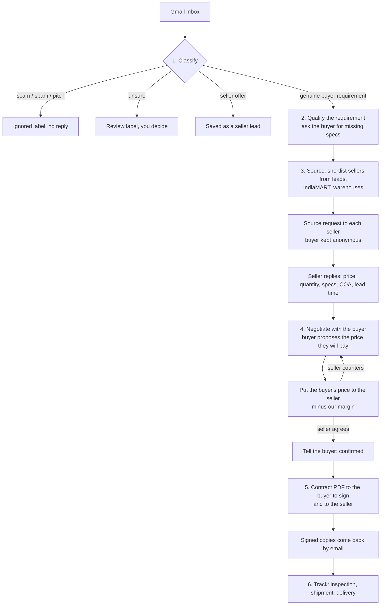
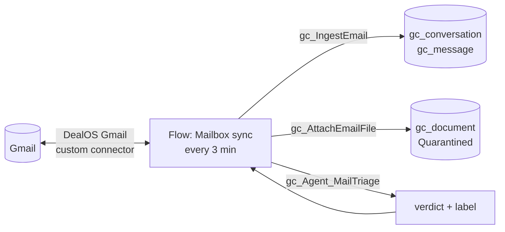

# Email Desk: plan

**Status (7 Oct 2026):** all four phases are built and live in Dev on the Gmail mailbox: classification, buyer requirement and sourcing, negotiation, contract and tracking. See section 12 for what a person does each day and section 10 for the test results.
**Read with:** [HANDOFF.md](../HANDOFF.md), [AGENTS.md](AGENTS.md), [WORKFLOWS.md](WORKFLOWS.md).

## 1. The idea in one picture

Mineral trade already runs by email. DealOS becomes **an email desk that works like a human trader in the middle**:

1. **Classify** every incoming email. Only **genuine buyer requirements** go further; everything else is ignored or parked.
2. **Source:** find sellers for the requirement in our lead data (trade-data exports, IndiaMART, warehouses) and email them.
3. **Negotiate with the buyer.** The buyer proposes the price they will pay, and we take it to the seller.
4. **Seller agrees** → we tell the buyer it is confirmed → **we send the buyer the contract to sign**.
5. **Track** after signing: inspection, shipment, delivery.

The buyer and the seller each deal **only with us**. They never see each other's identity. The agents write every email, and a person (you) checks each draft in Gmail and presses **Send**.

Nothing here touches money: **no escrow and no payment handling.** Payment terms are agreed and written into the contract; the parties pay as the contract says.

## 2. What changes from the current build

| Topic | Before | Now |
|---|---|---|
| Front door | Power Pages site plus chat | **Gmail** (the connected mailbox; none connected since the 7 Oct handover). The site and its chat agents were removed from the build on 7 Oct 2026 (the deployed site stays parked in Dev until its trial ends). |
| Who talks to whom | Buyer and seller met on the platform | **Back to back:** buyer ↔ us and seller ↔ us, in separate email threads |
| Sellers | Listed and verified on the site | **Sourced per requirement** from leads, IndiaMART and warehouses |
| Negotiation | Offers and counters on the site | **By email.** The buyer's proposed price goes to the seller, and a counter goes back. |
| Approval | Approvals connector (Teams or Outlook) | **Gmail:** a draft in the thread is the request, and pressing Send is the approval |
| Money | Escrow and staged release | **None.** Contract → signed → tracking. Our margin or commission is set out in the contracts (section 7). |

Unchanged: Dataverse as the record of truth, Document Intelligence for PDFs (LOI, COA, SGS reports), Pricing and Negotiation logic, Compliance, KYB and screening before the contract, and the stage guards.

## 3. The mailbox connection (built)

Everything runs in **Power Automate**, deployed from code like the other flows.

- **Custom connector `DealOS Gmail`** ([gmail.swagger.json](../tools/connectors/gmail.swagger.json), deployed by [deploy_connector.py](../tools/deploy_connector.py)). It wraps the Gmail API operations ListMessages, GetMessage, GetAttachment, ListLabels, CreateLabel, ModifyMessage and CreateDraft, and signs in with **our own Google OAuth app** (scope `gmail.modify`). Microsoft's built-in Gmail connector can't be used: on a consumer `@gmail.com` account it may only share a flow with an approved list of services, and Dataverse isn't on it, so a flow containing both is saved disabled. It also can't create drafts. ([Gmail connector: known limitations](https://learn.microsoft.com/en-us/connectors/gmail/))
- **Connection reference `gc_gmail`** carries the signed-in Gmail connection into the flows.
- **Flow `DealOS | Mailbox sync`** runs every 3 minutes, one run at a time, and only when `email.enabled` = true:
  1. Ensures the labels `DealOS/Buyer`, `Seller`, `Genuine`, `Review`, `Ignored`, `Processed` and `Error` exist.
  2. Lists mail matching `email.sync.query`, excluding anything already labelled Processed or Error (at most `email.sync.max_per_run`, default 5).
  3. For each email: `gc_IngestEmail` → fetch and store the attachments → `gc_Agent_MailTriage` → apply the verdict label plus `DealOS/Processed`.
  4. A failure is recorded in Flow failures and the email gets `DealOS/Error`. Remove that label in Gmail to retry it.
- **`gc_IngestEmail`** (operations plug-in, no AI):
  - one Gmail message → the conversation of its **Gmail thread** + a `gc_message` with direction, addresses, subject, plain text and metadata
  - metadata kept in `gc_emailmeta`: selected headers, labels, attachments and the **hard signals**
  - idempotent on the Gmail id; a sender who is already a contact links the thread to their company; mail from `email.self_addresses` is Outbound
- **`gc_AttachEmailFile`** stores an attachment (PDF, images, Office files, text, up to `email.attachments.max_mb`) as a `gc_document` in state **Quarantined**. Document intake therefore doesn't spend model calls on unscreened mail. Dangerous file types are never stored.

### One-time setup

**Part A: Google Cloud.** Sign in to Google as the mailbox account, or as any account that will own the app.
1. Open https://console.cloud.google.com/ → project picker (top left) → **New project** → name `DealOS Email Desk` → **Create**, then select it.
2. Open https://console.cloud.google.com/apis/library/gmail.googleapis.com → **Enable**.
3. Open https://console.cloud.google.com/auth/overview → **Get started**:
   - App name `DealOS Email Desk`, user support email = yours → **Next**
   - Audience **External** → **Next**
   - Contact email = yours → **Next**
   - Agree → **Create**
4. **Data access** (left menu) → **Add or remove scopes**. Paste `https://www.googleapis.com/auth/gmail.modify` under *Manually add scopes* → **Add to table** → **Update** → **Save**.
5. **Audience** → **Publish app** → **Confirm**. The status must say **In production**. It stays unverified, which is fine for our own mailbox. In "Testing", the sign-in expires every 7 days.
6. **Clients** → **Create client**:
   - Application type **Web application**, name `DealOS Power Automate`
   - **Authorised redirect URIs → Add URI:** `https://global.consent.azure-apim.net/redirect/gc-5fdealos-20gmail-5fc12c8485be9726a2`
   - **Create**. Copy the **Client ID** and the **Client secret**; the secret is shown only once, so keep it somewhere safe.

**Part B: the repo (Client ID only, never the secret)**

7. Add `GMAIL_CLIENT_ID=<client id>` to `.env`, then run `python3 tools/deploy_connector.py` (or send the Client ID to whoever runs the tools).

**Part C: Power Automate.** Use https://make.powerautomate.com, environment *Giga core's Environment*.

8. **Custom connectors** (under *… More → Discover all → Data*) → **DealOS Gmail** → ✏️ **Edit** → **2. Security**:
   - check that Identity provider is Google and the Client ID is filled in
   - paste the **Client secret**
   - **Update connector**
9. **Connections** → **+ New connection** → search `DealOS Gmail` → **Create** → choose the Gmail account the desk should read. Google warns *"Google hasn't verified this app"*: choose **Advanced → Go to DealOS Email Desk (unsafe)**, tick the Gmail permission → **Continue**.

**Part D: switch it on** (whoever runs the tools)

10. `python3 tools/deploy_connector.py bind` links that connection to `gc_gmail`.
11. Turn the desk on:
    - set `email.enabled` = `true` in Platform settings
    - run `python3 tools/deploy_flows.py --only "Mailbox sync"`, which deploys the latest flow and turns it on
12. **Test:** from any other email account, send a trade email to `<mailbox user>+dealos@<domain>` (for example `desk+dealos@gmail.com`). Within about 3 minutes it gets a `DealOS/…` label in Gmail, and the verdict is in Dataverse.

**Testing first:** `email.sync.query` starts as `to:{user}+dealos@{domain} newer_than:7d`, so only mail sent to the **+dealos** alias is read. Your personal inbox isn't sent to Gemini while the free tier is in use. To go live, change it to `in:inbox newer_than:7d`.

### Changing the mailbox (for example for production)

Nothing in the code or the flows is tied to one address. The flow asks Gmail which account the connection signed in with, and treats that account as "us" (`{user}` and `{domain}` in the query are filled from it).
1. In Power Automate, create a new **DealOS Gmail** connection signed in with the new mailbox (step 9). The Google app and the connector stay as they are; a Google Workspace address on the company domain works the same way.
2. Run `python3 tools/deploy_connector.py bind`. If both connections are listed, delete the old one first so the new one is picked.
3. Optional:
   - put extra aliases of ours in `email.self_addresses`
   - set `email.sync.query` for the new inbox
   - if the Google app should belong to the company, repeat Part A under the company account and redeploy with that Client ID (step 7)

Threads already stored keep their history. Mail in the new mailbox is read from the time the query allows (`newer_than:7d`).

## 4. Step 1: classification (built first)

### 4.1 Categories
| Category | Example | What happens |
|---|---|---|
| **Buyer requirement / RFQ / LOI** | Vanadium pentoxide 10–15 MT; BENE LLC strontium LOI (PDF) | Scored for genuineness → if genuine, step 2 |
| **Reply in one of our threads** | A buyer answering our questions; a seller answering our source request | Routed to that requirement or deal (no new scoring of the person, but the content is still checked for scam signals) |
| Offer to sell | Tanzanian thermal coal from Mtwara | Saved as a **seller lead** for sourcing; short acknowledgement drafted |
| Documents for an open item | COA, SGS report, signed contract | Attached to the requirement or deal |
| Service or vendor pitch | Freight forwarders, software, "SEO services" | Ignored |
| Scam or phishing | Advance-fee requests, fake "mandate" chains, credential links | Ignored |
| Not trade | Newsletters, personal mail, notifications | Ignored |

### 4.2 Signals
**Hard signals are computed in code**, so the model cannot argue with them:
- SPF, DKIM and DMARC results from Gmail's `Authentication-Results` header. A failure is a strong negative.
- Free-mail sender (gmail, yahoo, 163.com and so on) against a corporate domain. This is a mild negative only, because much genuine mineral trade uses free mail.
- The domain matches the website or company named in the signature.
- `Reply-To` differs from `From`.
- Dangerous attachments (`.exe`, `.js`, `.html`, password-protected `.zip`) and link domains that do not match the sender.
- Sender is already known: an account or contact in Dataverse, or an earlier thread with us. **A known sender is never ignored.**
- The origin is sanctioned (screening and country rules).

**The model judges** (OpenAI since 7 Oct 2026; Gemini before), in a new agent `gc_Agent_MailTriage`. These are the buyer-genuineness checks:
- **Specific specification:** grade or purity, impurity limits, sizing, packing. "Need rare earth, best price" is weak; the vanadium email is strong.
- **Realistic quantity** for the material and the buyer (50,000 MT of Dy₂O₃ is not).
- **Coherent terms:** Incoterm and named place, delivery window, payment terms.
- **Identifiable buyer:** company name, address, website or signature, and a real person with a role (BENE LOI: company, address, CEO, phone).
- **No broker-chain markers:** "buyer's mandate", "procedures", requests for upfront fees or a "soft corporate offer" before anything else.
- The commodity is one we trade and passes the compliance floor.

### 4.3 Decision
The verdict is a score from 0 to 100, the category and the reasons (shown to you in the draft or the label). Thresholds live in settings:

| Score | Action |
|---|---|
| ≥ `email.triage.proceed` (default 65) | **Genuine** → step 2 |
| between the two | **Review**: labelled; nothing is sent until you move the label |
| < `email.triage.ignore` (default 30), or any hard scam signal | **Ignored**: label only and no reply. The body is deleted after 30 days. |

Genuine means "worth working on". It does **not** mean the buyer is verified. KYB and screening still happen before the contract (step 5).

### 4.4 Learning from corrections (built 7 Oct 2026)
When you move an email to `DealOS/Genuine`, `DealOS/Buyer`, `DealOS/Seller`, `DealOS/Review` or `DealOS/Ignored` in Gmail, the next sync reads Gmail's label history and the email takes that verdict (Genuine starts the Trade Desk). The correction is kept on the email (`gc_triagecorrection`, `gc_correctedon`), and the latest 8 corrections are shown to the Mail Triage agent as examples. Labels the desk added itself change nothing.

## 5. Steps 2–4: from requirement to agreed price

A new agent, **`gc_Agent_TradeDesk`** (subject: `gc_conversation`), handles every genuine thread. It calls the specialist agents and **only drafts**.

### Step 2: qualify the requirement
- Creates the buyer account and contact (unverified) and a `gc_buyerrequirement` **Open**:
  - specs as attributes, for example V₂O₅ 98% min, P 0.05% max, −10 mm 5% max, +60 mm 10% max
  - quantity, packing, Incoterm and place, delivery date, the buyer's payment terms
  - the **confidential** flag when the buyer asks for it
- LOI PDFs are read by Document Intelligence (BENE: strontium metal 99% min, 3 MT, CIP Mumbai Airport or FCA origin).
- **Draft to the buyer:** confirms the specification back in one or two lines and asks only for what blocks sourcing (destination city, deadline, required documents). It never asks twice.

### Step 3: source sellers
- **Shortlist:** the Matching agent ranks **leads** (section 6) and any listings by commodity, specification fit, origin, recent export volume and past responses.
- For each shortlisted seller with an email address, it drafts a **source request** in a new thread. The request carries the specification, quantity, Incoterm and place, and a reply deadline, and asks for price, available quantity, origin, COA, lead time and the seller's payment terms. **The buyer's identity is never included.**
- Sellers without an email address (trade data often has none) go on a **call/find list** for you, with the company name and data source.
- Seller replies are read into **offers** (`gc_offer`, from seller), with the specification checked against the requirement and COAs through Document Intelligence.

### Step 3b: sellers take turns (decided 7 Oct 2026)
The buyer negotiates with **one seller at a time**:
- **The first seller to quote is the active seller** (`gc_buyerrequirement.gc_activedeal`). Their quote + our margin goes to the buyer at once.
- **Sellers who quote later are queued** in the order they answered. They get a short "noted, we will come back to you"; the buyer hears nothing about them. A later quote does not jump the queue, even if it is cheaper.
- **Sellers who have not answered stay open.** If one answers later, they join the queue (or become active if no seller is active).
- **Sellers who are not interested are left alone.**
- **The deal with the active seller breaks** when the seller withdraws, when the buyer turns the offer down (`buyer_rejects_offer`), or when the seller stays silent `desk.chase_after_hours` after a reminder while another seller is queued. Then:
  - **buyer still looking** → the active seller's deal closes (they get a polite note if the buyer turned it down), the **next queued seller becomes active**, and their offer is drafted to the buyer ("We have another offer for your requirement"). If nobody is queued, the requirement goes back to Sourcing and the first seller to quote comes up.
  - **buyer no longer looking** → the requirement closes and queued sellers get "not this time".
- When the buyer and the active seller agree (Confirm deal), the queued sellers get "not this time" too.
- Desk timers (every 15 minutes) also moves a buyer to the next queued seller if the active deal closed some other way.

### Step 4: negotiate (buyer ↔ us ↔ seller)
- **To the buyer:** when the active seller quotes, the Trade Desk drafts our offer (our price to the buyer, origin, lead time, terms). The seller's name is never shown. It **invites the buyer to propose their price**.
- **The buyer proposes a price** → recorded as a buyer offer.
- **To the seller:** the Negotiation agent works out the seller price as the **buyer's price minus our margin** (section 7) and drafts it to the seller as our firm bid.
- **The seller counters** → a new buyer price = the seller's counter **plus** our margin → drafted to the buyer. The loop repeats, with a round limit per deal (`negotiation.max_rounds`, default 4).
- **The seller agrees** → the deal moves to **Terms Agreed**, and a draft to the buyer says the price is confirmed and the contract follows.

**Risk check on seller terms:** when a seller asks for something risky (for example the Kyrgyz reply: 100% advance 2–3 months before dispatch, inspection only at their warehouse), the agent flags it to you. It proposes a safer structure (confirmed LC, staged advance against inspection) and never accepts such terms itself. Requests for the end user's details become a task for you, because answering would reveal the buyer.

### Many buyers, many sellers, over days (decided 7 Oct 2026)

Buyers and sellers are real people. A deal runs over hours or days, people write several emails before we answer, and several buyers can want the same seller's stock. The desk runs 24/7 in the cloud: Mailbox sync every 3 minutes and **Desk timers** every 15 minutes, so nothing depends on a laptop.

**Several emails, any order.** Emails are worked one at a time in arrival order (Trade desk concurrency 1). The agent sees the whole thread and any unsent draft, and its new draft replaces that draft but keeps whatever in it still matters.

**A fresh email instead of a reply.** A seller who writes a new email while we have an open enquiry with them joins that enquiry's thread (the enquiry whose name best matches the subject). A buyer's new email stays a thread of its own, because it is often a new requirement. The agent sees the buyer's other open requirements and opens a task when the email is really a follow-up.

**Two starting points.** A deal can start from either side:
- **Buyer first:** a buyer sends a requirement → we find sellers (sections 4–5 above).
- **Seller first:** a seller writes that they have material and need buyers → it becomes a **seller lot**. We find buyers (known requirements, buyer leads and an AI web search), send them our masked offer, and carry their answers to the seller and back.

**Seller lots** (`gc_sellerlot`). A seller offering stock with a price and a quantity (an offer to sell, or stock offered in a thread) becomes a lot:
1. **Marketing:** the lot is offered, masked, at the seller price + margin to buyers with an open requirement for that material and to matching buyer leads (at most `email.marketing.max_buyers` new buyers per round, default 5).
2. **Buyer search on the web** (flow **Buyer discovery**, `gc_DiscoverBuyers`): when a lot is created, the AI with web search looks for companies that use, import or distribute the material (public business contacts only). They are saved as buyer leads, and the lot is offered to the new ones (`gc_MarketLot`; buyers already offered are skipped). You get a briefing. It runs on OpenAI's web search (`agents.provider` = openai); under the Gemini free tier it was "Unavailable" and the lot went only to known buyers.
3. **The window: how long buyers can bid.** Each lot has its own window (`gc_window`, shown on the lot):
   - **from the seller's email:** "valid 24 hours" → 24 h, "2 days" → 48 h, "open until sold" → **open-ended**
   - **otherwise the default** `trade.bid_window_hours` (24; set it to 0 for open-ended by default)
   - never past the seller's own validity date
   - **you can change any lot** in the app: set the **Bid deadline** for a timed lot, or clear it to make the lot open-ended. A new window in a later seller email also changes it.
4. **Timed lot (24 h, 48 h, ...): buyers compete, the highest price wins.**
   - A buyer accepting our price or proposing their own (even above ours) is a **bid**, stored as the deal's buyer price and bid time. The buyer gets "noted; offers close on <deadline>". Nothing goes to the seller yet. A buyer who is not interested is recorded as a decline (`buyer_declines_lot`).
   - **Any number of buyers, including one.** Once every buyer the lot went to has bid or declined, offers close at once and Desk timers confirms within 15 minutes.
   - **Close** (Desk timers, `gc_CloseLots`): bids are ranked by **buyer price** (ties go to the earliest bid). From the top, a bid at or above the floor (seller price + margin) wins while the lot has enough quantity left. Each winner gets a **Confirm deal** task (a person still approves), and confirmation drafts go to the winner and the seller. The other bidders get a polite "allocated this time" draft and their lot deals close.
   - **No bid reaches the seller's price:** the **best bid goes to the seller** (buyer price − margin, as a draft) and the lot **carries on open-ended**: the seller decides.
5. **Open-ended lot: the seller decides when to close.**
   - Every buyer bid (an acceptance or a counter) **goes to the seller at once** as our firm bid: buyer price − margin, quantity, basis; never the buyer's name or price. The draft lists all our open bids on the lot, highest first. The buyer gets "we have put your offer to the supplier".
   - **The seller accepts a bid** ("we accept your bid of USD 31,500") → `seller_closes_lot`: our bids at or above that price win, highest first, while quantity lasts. Each winner gets a **Confirm deal** task at our bid to the seller; confirmation drafts go to the seller and the winners, and "not this time" drafts to the others.
   - **The seller counters** with a new price → the lot's price changes, and every buyer still in play gets our new price (seller price + margin) as a draft. Their acceptance or counter goes back to the seller in the same way.
   - **The seller withdraws** → lot Withdrawn, deals closed, bidders get "no longer available".
   - A seller who has not answered our bids after `desk.chase_after_hours` gets one chaser.
6. A seller's quote in an enquiry thread stays tied to that buyer's requirement; it does not become a lot.

**Chasers** (Desk timers, `gc_DeskFollowUps`):
- a seller who has not answered our enquiry (or the bids on their open-ended lot) after `desk.chase_after_hours` (default 48 h) gets one follow-up draft
- a buyer who has not answered our offer after the same time gets one follow-up draft (no price in it)
- buyers on an open lot who have not bid get a reminder when the deadline is under 6 hours away

## 6. Leads: where sellers come from

New table **`gc_lead`** for companies that are not yet parties:
- company, country, role (Buyer / Seller / Both), commodity, HS code
- source and its reference, last shipment date, volume
- email and phone if known
- status (New / Contacted / Responded / Converted / Do not contact)

| Source | How |
|---|---|
| **Trade-data exports** (like your import-shipment data: Calcium metal, China → India) | `python3 tools/import_leads.py <file.csv\|xlsx> --source "<provider>"`. It maps date, product description, supplier, purchaser, origin, destination and weight. Suppliers become **seller leads** and purchasers become buyer leads. Rows for the same company are rolled up into volume and last-shipment date per commodity. Check that the data provider's licence allows this use. |
| **IndiaMART** | The official **Lead Manager (CRM) API** of a paid IndiaMART seller account, which brings in the enquiries IndiaMART sends us. Supplier search on IndiaMART stays a manual step for you. Automated scraping breaks IndiaMART's terms and gets the account blocked. |
| **Warehouses** | Warehouses that share stock lists (CSV or email) become `gc_warehouse` plus seller leads, with the stock as available quantity. A stock-list email from a known warehouse is read automatically. |
| **Seller emails** | Offers to sell that arrive by email (Tanzanian coal) are saved as seller leads, with the claimed specification. |

**Outreach rules:** every email is reviewed by you, with no bulk sending. At most `email.outreach.daily_cap` (default 20) new source requests per day; consumer Gmail has its own sending limit. Every first contact includes an opt-out line, and "Do not contact" is permanent.

## 7. Step 5: contract, and step 6: tracking

### Contract
When the price is agreed:
1. **Compliance before contract:** the Compliance agent checks both parties. Basic KYB covers the company registration, director, address, GST/IEC (India) or registry and screening. Missing items are asked for by email **before** the contract goes out.
2. **Contract agent** builds the term sheet from the agreed offer: product and specification, quantity and tolerance, price, Incoterm and place, delivery window, payment terms, inspection, documents, and governing law.
3. **Contract PDF** from a template (new: a contract document generator in the plug-in assembly, plus a Word/PDF template you approve once with your lawyer).
4. **Draft to the buyer** with the contract attached, asking them to sign and return it. Separately, the seller gets their contract.
5. The **signed copy comes back by email**. Sync attaches it, you confirm it is signed (one click on the task), and the deal moves to **Signed**. E-signature (DocuSign or similar) can replace the scan-and-return step later.

**Decision needed: contract structure.** Because the buyer and seller never meet, there are two common set-ups:
- **Back to back** (recommended for this flow): two contracts, **buyer ↔ Gigacore** at the buyer's price and **Gigacore ↔ seller** at the seller's price. Our margin is the difference. Gigacore is legally the buyer's seller, so it carries contract risk (quality, delivery) unless the terms pass it through.
- **Brokered:** one sale contract buyer ↔ seller, plus a **commission agreement** with one side (percentage of contract value). Identities are revealed at signing.

The plan assumes **back to back with a margin %** (`trade.margin_percent`) until you decide. Confirm with your lawyer.

### Tracking (no payment)
Signed → **Inspection** (agency booked by you, report attached by email) → **In Transit** (B/L or AWB, documents checklist from the Logistics agent) → **Delivered** → **Closed**. The Trade Desk drafts the updates to the buyer and the chasers to the seller.

**Changes to existing flows:**
- **Contract signed:** drop `gc_OpenEscrow` and the funding request.
- **Inspection booking:** trigger on **Signed** instead of Funded.
- **Escrow funded**, **Release settled**, and the funding part of **Daily deadlines**: off through `deals.escrow.enabled` = false. They stay in the repo for later.
- **Commission invoice:** for the brokered model only.
- **Check first:** `gc_TransitionDeal` is in the old `DealOS.Plugins` DLL, and its source is not in the repo. Test on an `[AGENT-TEST]` deal whether **Signed → In Transit** is allowed with no payment. If it is refused, implement `gc_TransitionDeal` again in `DealOS.Agents` with the same guards minus escrow.
- All "do not reply" notifications become **drafts in the party's own thread**.

## 8. Rules the agents cannot break (enforced in code)

- **No identity leak:** a draft to a seller may not contain the buyer's name, company, email, phone or address, and the reverse. The message validator checks every draft against both parties' identifiers.
- **Numbers from the engine only:** every price in a draft comes from the requirement, an offer or the margin calculation. The agent never invents a figure.
- **No money instructions:** no bank details, no payment requests, no "pay to" lines.
- **No commitment without you:** nothing is sent automatically. Agreement, contract and price emails always wait as drafts.
- **One open draft per thread:** a new incoming email replaces a draft that has not been sent.
- **Voice:** short and plain, written the way a trader writes. No "I hope this email finds you well", no AI disclaimers. The signature is from `email.signature`. You press Send, so you are the author of record.

## 9. Data model changes

| Table | Change |
|---|---|
| `gc_conversation` | `gc_gmailthreadid` (key), `gc_triage` (Genuine / Review / Ignored), `gc_triagescore`, `gc_category`, `gc_side` (Buyer / Seller), `gc_requirement`, `gc_lead` |
| `gc_message` | `gc_direction` (Inbound / Outbound / Draft), `gc_fromaddress`, `gc_toaddresses`, `gc_subject`, `gc_authresults`, `gc_gmaildraftid`, `gc_triagecorrection`. `gc_externalid` = Gmail message id. |
| `gc_buyerrequirement` | `gc_confidential`, `gc_source` (Email / IndiaMART / Manual) |
| `gc_offer` | `gc_side` (Buyer bid / Seller offer / Our price to buyer / Our bid to seller), `gc_round` |
| `gc_lead` | new (section 6) |
| `gc_agent` choice | Mail Triage, Trade Desk |
| Settings | `email.enabled`, `email.gmail.history_id`, `email.triage.proceed`, `email.triage.ignore`, `email.outreach.daily_cap`, `email.signature`, `trade.margin_percent`, `negotiation.max_rounds`, `deals.escrow.enabled` |

## 10. Build order and status

**Phase 1: classification.** Built and live.
- [x] Schema, `MailPlugin` (`gc_IngestEmail`, `gc_AttachEmailFile`), Gmail parser and hard signals, `gc_Agent_MailTriage`
- [x] Custom connector **DealOS Gmail** (own Google OAuth app, In production), connection reference `gc_gmail`, flow **Mailbox sync** (on)
- [x] Test without Gmail: 7 of 7 sample emails correct (`tools/mail_test.py run`)

**Phase 2: buyer requirement and sourcing.** Built.
- [x] `gc_lead` table, [import_leads.py](../tools/import_leads.py) for trade-data exports (supplier → seller lead, purchaser → buyer lead, rolled up per company)
- [x] `gc_Agent_TradeDesk` with desk tools ([DeskTools.cs](../src/DealOS.Agents/Tools/DeskTools.cs)): `save_requirement`, `start_sourcing`, `save_seller_lead`, `draft_email` (masking and grounding checks)
- [x] `gc_SourceRequirement` / `Desk.Source`:
  - lead ranking by product words, shipments and recency
  - per seller with an email: account, deal (Inquiry, `gc_emaildesk`), RFQ invite, seller thread and a masked enquiry draft
  - leads without an email go to a "Find contacts" task
- [x] Flows **Trade desk** and **Desk drafts** (`gc_BuildEmailRaw`: RFC 2822, threaded reply, Reply-To alias, attachments)
- [x] Sent mail detection: Gmail gives a sent draft a **new id and drops its labels**, but keeps the **thread**. So sync records sent mail in known threads (the draft closes) and only marks other sent mail with the hidden `DealOS/Seen`.

**Phase 3: negotiation.** Built.
- [x] `save_seller_quote`, `quote_to_buyer` (seller price × (1 + `trade.margin_percent`)), `record_buyer_price` (bid = buyer price ÷ (1 + margin)), `buyer_accepts`, `seller_accepts_bid`
- [x] Acceptance opens **Confirm deal** (Deal Manager). Approval (Review decisions) sets the buyer price and accepts the offer. `gc_AcceptOffer` then moves the deal to Terms Agreed and closes the other sellers' deals.
- [x] Each closed seller who **quoted** gets a polite "not this time" draft in their thread (`Desk.RegretNote`): no price, no buyer, no reason beyond "the buyer closed the requirement". Sellers who declined or never replied get nothing. Hold it in Gmail if you want to keep that seller as a back-up until the contract is signed.
- [x] A draft that opens with a generic "Dear Buyer / Seller / Supplier" uses the contact's name (the sender name of their last email, else the lead's contact); with no name it becomes "Dear Sir or Madam".

**Phase 4: contract and tracking.** Built.
- [x] After Terms Agreed the existing flows run: Compliance (KYB and screening of both sides) → Contracting (Contract agent, Contract Issue approval)
- [x] Flow **Desk contract** / `gc_DeskContract`: on approval, two PDFs (back to back) are each attached to a draft in its thread
- [x] `report_signed_contract` → task → approval marks the contract Signed → **Contract signed** (no escrow for desk deals) → **Inspection booking** on Signed
- [x] End-to-end test by email only: [desk_e2e.py](../tools/desk_e2e.py) (results below)

**Phase 5: the owner in control by email (7 Oct 2026).** Built.
- [x] **Approve by reply** ([Approvals.cs](../src/DealOS.Agents/Mail/Approvals.cs), flow **Approval briefing**): every decision task is briefed to the owner with its details, any documents and a reply code `(ref XXXXXX)`. Reply `APPROVE` / `REJECT <reason>` / `SEND` / `PIPELINE`. Only the owner's replies count: sent from the mailbox itself, or from `desk.owner_email` **and** passing DMARC (or SPF and DKIM). A forged sender gets nothing done and the owner is told. One reminder after `desk.approval_remind_hours` (12). A Teams/Outlook approval answered later does not overwrite an email decision. Live test: [approval_e2e.py](../tools/approval_e2e.py).
- [x] **SEND by reply:** briefings list the drafts of that step (Trade desk runs, contracts, tracking). `SEND` sends them from Gmail as they stand (with any edits made there).
- [x] **Label corrections** (section 4.4): Mailbox sync reads Gmail's label history (`ListHistory`, `email.gmail.history_id`); an email moved to `DealOS/Genuine`, `Buyer`, `Seller`, `Review` or `Ignored` takes that verdict (Genuine starts the Trade Desk). Corrections are kept on the email (`gc_triagecorrection`) and the latest 8 are shown to Mail Triage as examples. Live test: [corrections_e2e.py](../tools/corrections_e2e.py).
- [x] **KYB documents from email:** `save_kyb_documents` files the attachments on the party's company (type, registration number), releases them to Document Intelligence and sets the party role, so Onboarding KYB / Buyer Verification run and open the Tier upgrade approval. A person approves; when KYB passes, flow **KYB passed: compliance re-check** runs Compliance again for that party's deals waiting at Compliance Check.
- [x] **Tracking updates** ([Tracking.cs](../src/DealOS.Agents/Mail/Tracking.cs), flows **Desk tracking: inspection / shipment**): inspection booked / passed / failed and loading / sailing / arrival / delivery are drafted to each side, masked (the buyer never sees the seller's name, warehouse or documents), each status once per side, briefed for SEND. `record_shipment_update` lets the Trade Desk record what a party reports. Live test: [tracking_e2e.py](../tools/tracking_e2e.py).
- [x] **Company profile:** `python3 tools/company_profile.py set <pdf>`; the Trade Desk attaches it (`draft_email attach=company_profile`) when a party asks. No profile on file: a task, as before.
- [x] **E-signature (DocuSign)**, off until switched on (`contract.esign` = docusign): after the contract terms are approved, both PDFs are generated and a **Send for e-signature** approval with the PDFs is briefed. Nothing goes out before APPROVE. Then one envelope per side (the party signs, then `contract.signatory` countersigns); Desk e-signature status polls every 15 minutes and stores the signed PDFs; both signed → contract Signed → inspection. Declined → task. See "E-signature setup" below.
- [x] **Pipeline:** reply `PIPELINE` to any briefing, the daily digest (it goes out even when the AI summary fails), and the admin app area **Email desk** (requirements by stage with a chart, lots, deals, contracts out, decisions waiting, drafts waiting) from [deploy_app.py](../tools/deploy_app.py).

**Not built**
- [ ] IndiaMART Lead Manager API (needs a paid IndiaMART seller account). IndiaMART listings already come in through the web search; scraping IndiaMART is against its terms and gets the account blocked, so the desk does not scrape it.

### E-signature setup (DocuSign)
1. A DocuSign developer (sandbox) account: https://developers.docusign.com (free). Note the **API Account ID** (Settings → Apps and Keys).
2. `python3 tools/deploy_connector.py docusign` (done in Dev: connection reference `gc_docusign` on **Docusign Demo**).
3. Power Automate → Connections → New connection → **Docusign Demo** → sign in with the sandbox account.
4. `python3 tools/deploy_connector.py docusign-bind`, then `python3 tools/deploy_flows.py --esign` (the two e-signature flows; saved off in Dev until then).
5. Settings: `esign.docusign.account_id` = the API Account ID; `contract.signatory` = `Name <email>` of our authorised signatory; `contract.esign` = `docusign`.
6. Run one test deal end to end in the sandbox (signatures there are not legally binding). For production: a paid DocuSign plan, `deploy_connector.py docusign --prod`, a **Docusign** (production) connection, bind and `deploy_flows.py --esign` again.

## 11. Risks and open points

- **Decision needed from you:**
  - back-to-back or brokered contract (section 7)
  - our margin or commission percentage
  - whose name goes in the email signature
- **A personal Gmail as the trading identity** looks less credible to counterparties. Moving to a company-domain mailbox later only changes the mailbox connection.
- **Back-to-back carries contract risk:** if the seller fails, Gigacore is liable to the buyer unless the contract passes it through. Get the template reviewed.
- **Gemini free tier (5 requests per minute):** every inbound email costs a triage call, and each genuine thread costs Trade Desk runs. Billing stays deferred, as agreed, but it limits throughput.
- **Unverified Google app:** fine for our own mailbox. If Google revokes the sign-in, fix the DealOS Gmail connection in Power Automate (*Connections → Fix connection*). Sync failures go to Flow failure triage.
- **Personal data (DPDP):** emails and LOIs contain names and phone numbers. Ignored mail is purged after 30 days.
- **Misclassification:** a genuine buyer marked Ignored costs a deal. That is why known senders are never ignored, there is a Review band, and corrections are tracked.

## 12. Running the desk: what a person does

The bot reads the mailbox, classifies, records and drafts. A person stays in control at these points:

| When | Where | What you do |
|---|---|---|
| A briefing asks for a decision (`Approve? ... (ref XXXXXX)`) | **Gmail**, the "DealOS desk briefing" thread | Reply with one word on the first line: `APPROVE` (or CONFIRM / YES / OK / DONE), `REJECT <reason>`. `SEND` sends the drafts the briefing lists; `APPROVE SEND` does both; `PIPELINE` shows where everything stands. The admin app and Teams approvals still work too; the first answer counts. |
| A draft is waiting | **Gmail → Drafts** (in the thread) | Read it, edit if needed, press **Send** (or reply `SEND` to its briefing). Unsent drafts are replaced when a newer email arrives in the thread. |
| An email is labelled `DealOS/Review`, or labelled wrongly | Gmail | Move it to `DealOS/Genuine` (or `Buyer` / `Seller`) to let the desk work it, or to `DealOS/Ignored`. The next sync applies it and the triage learns from it. |
| "Find contacts for sourcing: …" | Admin app → Review tasks | Find an email for the listed sellers, put it on the lead, then ask the desk to source again (reply in the buyer thread, or run `gc_SourceRequirement`). |
| "Confirm deal: …" | Review tasks (or Approvals in Teams/Outlook) | Check the price and terms in the payload, then approve. That makes the agreement binding. Then send the confirmation drafts. |
| KYB documents arrive | Briefing "Approve? Tier upgrade ..." | The desk files them on the company and the KYB agent checks them; approve the tier upgrade by reply. Record the sanctions screening in the admin app (the account); Compliance then lets the deal go to contracting. |
| "Review contract terms: …" (Contract Issue) | Briefing | Approve. Both contracts are generated: with e-signature off they are drafted to each side (reply `SEND`); with DocuSign on you get **Send for e-signature** with both PDFs attached, and nothing goes out before you approve it. |
| "Signed contract received: …" | Review tasks | Check the signed copy (attached to the deal). When both sides have signed, approve; the deal moves to Signed. |
| "Book independent inspection: …" | Review tasks | Book the agency and set the inspection to Booked. |
| "Trade desk could not handle: …" | Review tasks | Reply yourself from Gmail, or fix the cause and set the email back to Genuine. |

**Settings to decide** (Platform settings):
- `trade.margin_percent`: currently 3, a placeholder
- `email.signature`
- `trade.company_name`
- `trade.governing_law`: confirm with counsel
- `email.sourcing.max_sellers`
- `contract.esign` (off / docusign), `contract.signatory`, `esign.docusign.account_id`
- `desk.approval_remind_hours`, `desk.company_profile` (set with `tools/company_profile.py`)

**To go live on the whole inbox:**
- set `email.sync.query` = `in:inbox newer_than:7d`
- set `email.reply_to` = empty
