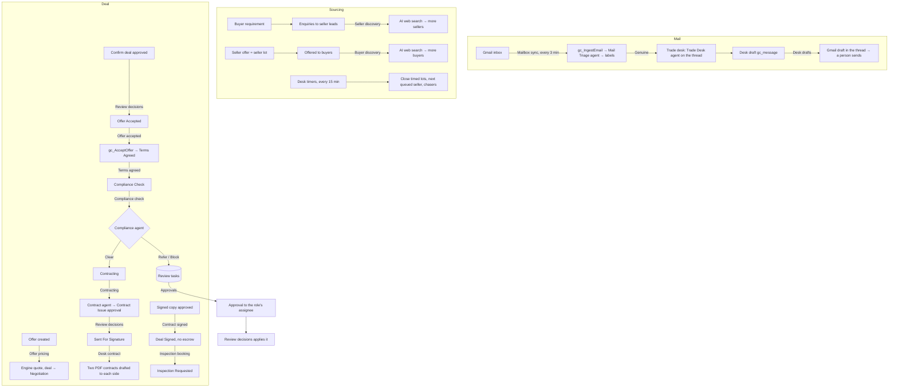

# DealOS Workflows

**As of:** 7 October 2026
**Environment:** Giga core's Environment (Dev), solution `DealOS`

The agents ([AGENTS.md](AGENTS.md)) do the reasoning. The **flows** listed here decide when each agent runs and what happens with its result. **Operations** custom APIs make the changes that must be exact (accepting an offer, storing an email, building a contract). No AI is involved in the operations.

All flows are generated from code ([tools/flows/definitions.py](../tools/flows/definitions.py)) and deployed with `python3 tools/deploy_flows.py`. Change the code and redeploy. If you edit a flow in the designer, the next deploy overwrites it.

**Removed on 7 Oct 2026.** The website and marketplace flows were removed, so that only the email desk and the flows its deals go through remain: listing verification, matching, match notifications, website RFQ invites, escrow funding, milestones, releases, commission invoices, disputes, ratings, deal settled, daily deadlines, daily sweep and the Notify party child flow. Their definitions are in git history (commit `b879fec`). `deploy_flows.py` turns off and deletes any of them still in an environment (`definitions.RETIRED`).

---

## The desk, end to end



---

## Flow catalogue (26 flows, plus 2 e-signature flows once DocuSign is connected)

| Flow | Trigger | What it does | Human gate |
|---|---|---|---|
| **Mailbox sync** | every 3 minutes, when `email.enabled` = true | Gmail (custom connector **DealOS Gmail**, connection reference `gc_gmail`): first the owner's label corrections (Gmail history since `email.gmail.history_id` → `gc_TriageCorrections`), then new mail → `gc_IngestEmail` + `gc_AttachEmailFile` → Mail Triage agent → Gmail labels; then the sent-mail pass. A reply to a briefing is a command (approve by reply), never triaged. | — |
| **Trade desk** | a received email's triage → Genuine | Trade Desk agent on the email's thread → briefing listing the drafts of the run (reply SEND). On failure, a Deal Manager task. | — |
| **Desk drafts** | desk draft `gc_message` (Pending, Discarded, or released by SEND) | Pending → `gc_BuildEmailRaw` → a Gmail draft in the thread (auto-sent only when flagged). Released by the owner's SEND → the Gmail draft is sent. Discarded → the Gmail draft is deleted. | A person sends it (Gmail or SEND) |
| **Desk contract** | contract → Sent For Signature on a desk deal | `gc_DeskContract`: back-to-back PDFs (sales contract to the buyer at our price, purchase contract from the seller at their price). Scan and return: each on a draft in its thread, briefed with the PDFs (SEND). DocuSign on: a **Send for e-signature** approval with both PDFs; nothing goes out before it. | Send (SEND) / Send for e-signature |
| **Approval briefing** | review task created (Open) | `gc_DeskBriefTask`: the decision briefed to the owner with its details, documents and a reply code; one reminder later (Desk timers). | APPROVE / REJECT by reply |
| **Desk tracking: inspection** | inspection → Booked, Passed or Failed | `gc_DeskTrack`: masked updates drafted to the buyer and the seller (each status once per side) → briefing (SEND). | A person sends them |
| **Desk tracking: shipment** | shipment → Loading, In Transit, Arrived or Delivered | Same, for the shipment (sailing and ETA to the buyer, shipping documents request to the seller, delivery). | A person sends them |
| **KYB passed: compliance re-check** | account KYB status → Passed | Its email desk deals waiting at Compliance Check run the Compliance agent again: Clear → Contracting; otherwise a briefing with what is missing. | — |
| **Desk e-signature send** (`--esign`) | contract e-signature status → Sending (the owner approved) | `gc_EsignEnvelopes` → per side a DocuSign envelope (contract PDF; the party signs, then `contract.signatory`) → sent → `gc_EsignRecord`. Failure → status Failed and a briefing. | Approved before it runs |
| **Desk e-signature status** (`--esign`) | every 15 minutes | Envelopes out (`gc_EsignPending`) → DocuSign recipients → all signed: signed PDF stored; both sides → contract Signed. Declined → task. | — |
| **Seller discovery** | requirement desk stage → Sourcing | `gc_DiscoverSellers` (AI web search: producers and exporters, public contacts) → enquiries to new leads with an email → briefing | — |
| **Buyer discovery** | a seller lot is created (seller first) | `gc_DiscoverBuyers` (AI web search: companies that use, import or distribute the material) → the lot is offered to the new buyer leads (`gc_MarketLot`) → briefing | — |
| **Desk timers** | every 15 minutes | 1. `gc_CloseLots`: timed seller lots past their deadline: highest buyer prices win while quantity lasts; no bid at the seller's price → best bid to the seller, lot goes open-ended. 2. `gc_DeskFollowUps`: next queued seller when the active seller's deal closed or the seller is silent after a reminder; one chaser to silent sellers and buyers; reminders before lots close. | — |
| **Document intake** | `gc_document` file uploaded or set back to Pending | Document Intelligence on the document (e.g. a COA released by the Trade Desk). A party's own document → Onboarding KYB / Buyer Verification. | — |
| **Party onboarding** | `account` gets the Seller or Buyer role and KYB has not started | KYB status → In Progress. Runs Onboarding KYB (seller) and/or Buyer Verification (buyer). | Tier Upgrade, Message Send |
| **Offer pricing** | `gc_offer` created | `gc_CalculatePriceQuote` (the engine quote `gc_AcceptOffer` needs). On the first offer the deal moves Inquiry → Negotiation. | — |
| **Offer accepted** | `gc_offer` status → Accepted | `gc_AcceptOffer`. If it refuses, the offer goes back to Open and a Deal Manager task says why. | — |
| **Terms agreed** | deal stage → Terms Agreed | Moves the deal → Compliance Check. | — |
| **Compliance check** | deal stage → Compliance Check | Compliance agent. Clear → Contracting. Refer → Compliance Officer task. Block → Compliance Hold overlay plus a task. | Screening Clearance |
| **Contracting** | deal stage → Contracting | Contract agent drafts `gc_contract` and opens Contract Issue. Missing terms → Deal Manager task. | Contract Issue |
| **Contract signed** | `gc_contract` status → Signed | Deal → Signed (no escrow: payment is between the parties per contract); the requirement's desk stage → Signed. | — |
| **Inspection booking** | deal stage → Signed | One `gc_inspection` (Requested) and a Logistics Coordinator task to book an independent agency. | Booking (task) |
| **Inspection result** | inspection → Passed or Failed | Passed: a `gc_verification` (independent inspection, Confirmed) with the report. Failed: deal On Hold and a Deal Manager task (renegotiate or cancel). | — |
| **Deal cancelled** | deal stage → Cancelled | `gc_ReleaseDeal` rejects the deal's open offers. The desk drafts any note to the parties itself. | — |
| **Approvals** | review task opened, kind Approval or Review | Sends an approval to the assignee of the task's role (`approvals.assignees`) and records the answer on the task, unless the owner already answered by email. | — |
| **Review decisions** | review task → Approved / Rejected | Applies the decision; see below. | — |
| **Daily digest** | 03:00 UTC daily | The pipeline (`gc_DeskPipeline`) and the AdminSupervisor agent's digest as a desk briefing (`gc_DeskBrief`, Gmail); the pipeline goes out even when the agent fails. | — |
| **Flow failure triage** | every hour | Groups new `gc_flowfailure` rows per flow into one Support review task with the run links. | Resubmit the runs |

### What each decision does (Review decisions)

| Purpose | Approved | Rejected |
|---|---|---|
| Other: `desk.accept_offer` (**Confirm deal**) | Deal's buyer price set, offer → Accepted; Offer accepted takes over (Terms Agreed, compliance, contract) | nothing |
| Other: `desk.contract_signed` (**Signed contract received**) | Contract → Signed (Contract signed takes over) | nothing |
| Other: `desk.esign_send` (**Send for e-signature**) | Contract e-signature status → Sending (Desk e-signature send takes over) | Status Rejected; nothing is sent; briefing |
| Message Send | A request an agent drafted (e.g. KYB documents) → Approved; the desk sends requests as Gmail drafts | Rejected |
| Tier Upgrade | Trust tier from the payload; KYB status Passed at KYB Verified or higher | — |
| Screening Clearance (deal) | Compliance Hold lifted, deal → Contracting (only while it is still at Compliance Check) | Deal → Cancelled |
| Screening Clearance (party) | Compliance hold off | Compliance hold on |
| Contract Issue | Contract → Sent For Signature (Desk contract takes over) | Contract → Void |
| Shipment Booking | `gc_shipment` Planned (Domestic or International) | — |

An answer by email reply (approve by reply), an approval answered in Outlook or Teams and a status changed by hand in the admin app all follow the same path; the first answer counts.

---

## Operations (deterministic custom APIs)

| API | Plug-in type | What it does |
|---|---|---|
| `gc_AcceptOffer` | `Operations.OperationsPlugin` | Offer Open or Countered and not expired; deal at Inquiry or Negotiation with no overlay. Prices the offer if it has no quote, copies its terms to the deal, rejects the deal's other open offers, closes competing deals on the same requirement once covered (their sellers get a "not this time" draft), then moves the deal to Terms Agreed through `gc_TransitionDeal`. |
| `gc_ReleaseDeal` | `Operations.OperationsPlugin` | Cancelled deals only: rejects their open offers. |
| `gc_IngestEmail`, `gc_AttachEmailFile`, `gc_BuildEmailRaw` | `Mail.MailPlugin` | Gmail message → thread + message (idempotent); attachment → Quarantined document; desk draft → RFC 2822 reply with In-Reply-To and attachments. |
| `gc_SourceRequirement`, `gc_DiscoverSellers` | `Mail.MailPlugin` | Enquiries to matching seller leads; AI web search for sellers. |
| `gc_DiscoverBuyers`, `gc_MarketLot`, `gc_CloseLots` | `Mail.MailPlugin` | AI web search for buyers of a lot; offer a lot to buyers not offered yet; close timed lots. |
| `gc_DeskBrief`, `gc_DeskContract`, `gc_DeskFollowUps` | `Mail.MailPlugin` | Briefing to the owner (optionally listing drafts for SEND); back-to-back contract PDFs and drafts (or the e-signature approval); seller queue, chasers, reminders and approval reminders. |
| `gc_DeskBriefTask`, `gc_DeskPipeline` | `Mail.MailPlugin` | A decision briefed with a reply code; the pipeline as text. |
| `gc_TriageCorrections` | `Mail.MailPlugin` | Gmail label history → the owner's corrections applied to the stored verdicts. |
| `gc_DeskTrack` | `Mail.MailPlugin` | Inspection or shipment status → masked tracking drafts to both sides, each once. |
| `gc_EsignEnvelopes`, `gc_EsignRecord`, `gc_EsignPending`, `gc_EsignUpdate` | `Mail.MailPlugin` | DocuSign envelopes to send; envelope ids; envelopes still out; signers' status → signed PDF stored, contract Signed when both sides are done. |

---

## Conventions

- **Try / Catch** in every flow. Catch writes a `gc_flowfailure` row (step, error, trigger payload and run link) and fails the run.
- **Agent calls** use *Perform an unbound action* with **no connector retries**, because each retry would be another paid model run; the agent already falls back between models. After each call, a check reacts to `Status`: critical agents (Compliance, Contract, AdminSupervisor) record the failure and stop; advisory ones (KYB) record it and continue.
- **Concurrency 1** on agent-heavy triggers keeps the model rate limits and the deal locks predictable.
- **Stage changes go only through `gc_TransitionDeal`.** Its guards (KYB verified, screening clear, contract signed) are the real gate. When it refuses, the flow opens a Deal Manager task with the reasons; it never forces the stage.
- **Audit:** every flow writes a `gc_auditevent` (actor `flow:<name>`).
- **Parties hear from the desk only through Gmail drafts** that a person sends. Flows never email buyers or sellers.

---

## Developer workflow

```bash
python3 tools/deploy_agents.py                     # plug-in, agents, operations, settings (retires removed APIs)
python3 tools/deploy_flows.py                      # all flows: create/update, turn on, delete retired flows
python3 tools/deploy_flows.py --only "Trade desk"  # one flow (name substring)
python3 tools/deploy_flows.py --dump build/flows   # just write the generated JSON
python3 tools/export_solution.py                   # sync solutions/ with Dev
```

**Writing a definition:** use `run_agent(name, subject, label, flow, on_fail=...)` for agents, `unbound(api, ...)` for operations, `transition(deal, STAGE[...], reason)` plus a check on `Allowed` for stage changes. Action names must be unique within a flow.
