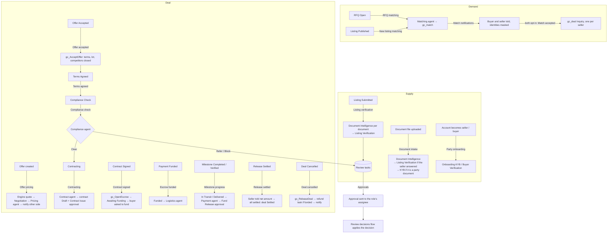

# DealOS Workflows

**As of:** 6 October 2026
**Environment:** Giga core's Environment (Dev), solution `DealOS`

The agents ([AGENTS.md](AGENTS.md)) do the reasoning. The **flows** listed here decide when each agent runs and what happens with its result. Four **operations** custom APIs make the changes that must be exact, such as reserving a lot, opening escrow and instructing a release. No AI is involved in the operations.

All flows are generated from code ([tools/flows/definitions.py](../tools/flows/definitions.py)) and deployed with `python3 tools/deploy_flows.py`. Change the code and redeploy. If you edit a flow in the designer, the next deployment overwrites your change.

---

## The trade, end to end



Each arrow label is a flow. A box ending in "agent" is a `gc_Agent_*` call.

---

## Flow catalogue

| Flow | Trigger | What it does | Human gate |
|---|---|---|---|
| **Listing verification** | `gc_listing` status → Submitted | Status → In Verification. Runs DocumentIntelligence on each pending document (a failed document is marked Failed and the loop goes on), then ListingVerification. | Listing Publish, Message Send |
| **Document intake** | `gc_document` file uploaded or set back to Pending | DocumentIntelligence runs on the document, then by context: if the listing is Needs Info (the seller answered an ask), ListingVerification; if it's a party's own document, OnboardingKYB or BuyerVerification. It skips documents of a listing still at Submitted, which Listing verification handles. | — |
| **Party onboarding** | `account` gets the Seller or Buyer role and KYB has not started | KYB status → In Progress. Runs OnboardingKYB (seller) and/or BuyerVerification (buyer). | Tier Upgrade, Message Send |
| **RFQ matching** | `gc_buyerrequirement` status → Open | Runs the Matching agent, which proposes `gc_match` rows. | Both sides opt in |
| **New listing matching** | `gc_listing` status → Published | Re-runs Matching for up to 5 of the newest open RFQs for the same commodity. | — |
| **Match notifications** | `gc_match` created | Tells the buyer and the seller, without either identity. | — |
| **Match accepted** | `gc_match` buyer and seller both opted in | Match → Mutual. Creates one `gc_deal` (Inquiry) linked to the RFQ (`gc_requirement`), then notifies both sides. | — |
| **Offer pricing** *(extended)* | `gc_offer` created | Runs `gc_CalculatePriceQuote`. On the first offer the deal moves Inquiry → Negotiation. The Pricing agent explains the numbers, and the other party is notified. | — |
| **Offer accepted** | `gc_offer` status → Accepted | Calls `gc_AcceptOffer`. If it refuses, the offer goes back to Open and a Deal Manager task says why. | — |
| **Terms agreed** | deal stage → Terms Agreed | Notifies both parties, then moves the deal → Compliance Check. | — |
| **Compliance check** | deal stage → Compliance Check | Runs the Compliance agent. Clear → Contracting. Refer → Compliance Officer task. Block → Compliance Hold overlay plus a task. | Screening Clearance |
| **Contracting** | deal stage → Contracting | The Contract agent drafts `gc_contract` and opens Contract Issue. If terms are missing, the Deal Manager gets a task. | Contract Issue |
| **Contract signed** | `gc_contract` status → Signed | Deal → Signed. `gc_OpenEscrow` opens escrow, then the deal → Awaiting Funding. The Payment agent runs, and the buyer is asked to fund. | — |
| **Escrow funded** | `gc_payment` state → Funded | Deal → Funded. The Logistics agent builds the checklist and milestones and asks for booking. Both sides are notified. | Shipment Booking |
| **Milestone progress** | `gc_milestone` → Completed or Verified | B/L or Departure → In Transit. Delivered → Delivered. The Payment agent checks release readiness and opens Fund Release approvals. | Fund Release (Finance) |
| **Release settled** | `gc_paymentrelease` → Settled | Tells the seller the net amount. When every release is settled, the payment and the deal → Settled. | — |
| **Deal cancelled** | deal stage → Cancelled | `gc_ReleaseDeal` frees the lot and rejects open offers. Finance gets a Refund task if escrow was funded. Both sides are notified. | Refund |
| **Approvals** *(changed)* | Review task opened, kind Approval **or Review** | Sends an approval to the assignee of the task's role (`approvals.assignees`) and records the decision on the task. It **no longer applies** the decision. | — |
| **Review decisions** | Review task → Approved / Rejected (any source) | Applies the decision; see the next section. | — |
| **Notify party** | child flow | Emails a party (account email, otherwise the primary contact's), or only records the message; see [Notifications](#notifications). | — |
| **Daily digest** | 03:00 UTC daily | Runs the AdminSupervisor agent and emails the digest. | — |
| **Daily sweep** *(unchanged)* | 02:00 UTC daily | Re-checks expired facts and expires stale offers. | — |
| **RFQ invite sent** | `gc_rfqinvite` created (Invited) | Stamps the seller (from the listing) and the invite date, then tells the seller without naming the buyer. | — |
| **RFQ invite answered** | invite → Accepted or Declined | Accepted: one deal (Inquiry) linked to the RFQ and listing, invite linked to it, buyer told. Declined: buyer told. | — |
| **Inspection booking** | deal stage → Funded | One `gc_inspection` (Requested) for the deal's lot, a Logistics Coordinator task to book an independent agency, both parties told. | Booking (task) |
| **Inspection result** | inspection → Passed or Failed | Passed: a `gc_verification` (inspection, Confirmed) with the report and agency, the Inspection milestone Completed with the report (Milestone progress takes over). Failed: deal **On Hold**, Deal Manager task (renegotiate or cancel with refund), both told. | Off-spec decision |
| **Dispute opened** | `gc_dispute` created | Deal overlay **Disputed**, so `gc_InstructRelease` refuses every release. Deal Manager task linked to the dispute, dispute Under Review, both told. | Resolution |
| **Dispute closed** | dispute → Resolved or Withdrawn | Cancels the dispute's open task. Lifts the overlay when no other dispute is open. A refund outcome opens a Finance Refund task; a cancel outcome moves the deal to Cancelled. Both told. | Refund (Finance) |
| **Deal settled** | deal stage → Settled | Each KYB-verified party gets a Tier Upgrade approval to Trade Verified (first settled trade); both are asked to rate. | Tier Upgrade |
| **Rating received** | `gc_rating` created | Stamps the date; a score of 2 or less opens a Support review on the rated party. | — |
| **Commission invoice** | release → Settled with commission | One Draft commission invoice (bill to the seller, amount = commission deducted at source) for Finance to complete and issue. | Issue (Finance) |
| **Daily deadlines** | 02:30 UTC daily | Expires RFQs past validity (buyer told) and invites unanswered for `rfq.invite_days` (default 5). Deal Manager task when escrow is not funded by the deadline (**never cancels on its own**). Funding reminder 2 days before. Logistics task when an inspection result is 2 days overdue. | Extend or cancel |
| **Flow failure triage** | every hour | Groups new `gc_flowfailure` rows per flow into one Support review task with the run links. One open task per flow. | Resubmit the runs |
| **Mailbox sync** (Email Desk) | every 3 minutes, when `email.enabled` = true | Gmail (custom connector **DealOS Gmail**, connection reference `gc_gmail`) → `gc_IngestEmail` + `gc_AttachEmailFile` → Mail Triage agent → Gmail labels `DealOS/Buyer`, `Seller`, `Genuine`, `Review` or `Ignored`, plus `Processed`. Then sent mail: a reply sent from a desk thread is recorded and its draft closes; other sent mail gets the hidden label `DealOS/Seen`. Failures → `DealOS/Error`. See [EMAIL_DESK.md](EMAIL_DESK.md). | — |
| **Trade desk** (Email Desk) | received email's triage → Genuine (by Mail Triage or a person) | Trade Desk agent on the email's thread. On failure, a Deal Manager task. | — |
| **Desk drafts** (Email Desk) | desk draft `gc_message` (Pending, or Discarded) | Pending → `gc_BuildEmailRaw` → a Gmail draft in the thread (new thread for a first enquiry; the thread id is saved). Discarded → the Gmail draft is deleted. | A person sends it from Gmail |
| **Desk contract** (Email Desk) | contract → Sent For Signature on an email desk deal | `gc_DeskContract`: back-to-back PDFs (sales contract to the buyer at our price, purchase contract from the seller at their price), each attached to a draft in its thread | — |

### What each decision does (Review decisions)

| Purpose | Approved | Rejected |
|---|---|---|
| Listing Publish | Listing Published, `publishedon` = now | Listing → Needs Info |
| Message Send | Message Approved. A *Source* request is emailed to the task's party (then marked Sent), and its listing → Needs Info | Message Rejected |
| Tier Upgrade | Trust tier = the tier in the task payload. KYB status Passed if the tier is KYB Verified or higher | — |
| Screening Clearance (deal) | Compliance Hold lifted, deal → Contracting. If the stage guards refuse, the Deal Manager gets a task | Deal → Cancelled |
| Screening Clearance (party) | Compliance hold off | Compliance hold on |
| Contract Issue | Contract → Sent For Signature, and both parties are told | Contract → Void |
| Fund Release | `gc_InstructRelease` (re-checks every gate in code) | — |
| Shipment Booking | `gc_shipment` Planned (Domestic or International from the deal's countries) | — |

Because decisions are applied by their own flow, an approval answered in Outlook or Teams and a status changed by hand in the admin app follow the same path.

---

## Operations (deterministic custom APIs)

These run in the `DealOS.Agents` assembly as the plug-in type `DealOS.Agents.Operations.OperationsPlugin`. Each call is **one transaction**: a refusal throws an error, and nothing is saved.

| API | Inputs → outputs | Rules |
|---|---|---|
| `gc_AcceptOffer` | `OfferId` → `Status` (Accepted / AlreadyAccepted), `DealId`, `Stage`, `ClosedDeals`, `Summary` | Offer Open or Countered and not expired. Deal at Inquiry or Negotiation with no overlay. Prices the offer if it has no quote. Copies the price, quantity, currency, Incoterm, named place, payment terms and quote to the deal. **Reserves the lot**, splitting it when the offer is for part of it: the rest becomes a new Available lot, and other deals move to that lot. Rejects the deal's other open offers. **Closes competing deals:** on the same lot if it is fully taken, and on the same RFQ once accepted quantities cover it (RFQ → Fulfilled). Then moves the deal to Terms Agreed through `gc_TransitionDeal`. Concurrent accepts are serialised by row locks on the deal and the lot, so only one wins. |
| `gc_OpenEscrow` | `DealId` → `Status` (Opened / Exists), `PaymentId`, `Releases`, `Summary` | Deal Signed or Awaiting Funding. Creates one `gc_payment` (Awaiting Funding, amount = value + buyer-paid commission, deadline from `escrow.funding_days`). Creates one `gc_paymentrelease` per tranche in `escrow.default_schedule`, using the same commission maths as the Payment agent. |
| `gc_ReleaseDeal` | `DealId` → `Status`, `Lots`, `Offers`, `Summary` | Cancelled deals only. Frees the lots reserved for the deal and rejects its open offers. |
| `gc_RefreshCatalog` | `ListingId` (optional) → `Refreshed`, `Removed` | Rebuilds the public masked catalog entry (`gc_catalogentry`) of one listing, or of every published listing, removing stale entries. Normally the `CatalogPlugin` does this on every listing, fact or lot change; see [PORTAL.md](PORTAL.md). |
| `gc_InstructRelease` | `ReleaseId` → `Status` (Instructed / AlreadyInstructed), `Summary` | Requires an **Approved Fund Release task** for this release, a funded payment, and no hold, dispute or compliance overlay on the deal. Sets the release → Instructed and the payment → Release Instructed. Finance then instructs the escrow partner; this step becomes an API call once a partner is chosen. |

There is also a new column, **`gc_deal.gc_requirement`** (lookup to `gc_buyerrequirement`). It records the RFQ a deal came from. In code and OData, its navigation property is `gc_Requirement`.

---

## Notifications

Every message to a buyer or seller goes through **Notify party**. Its text is a fixed template in the flow, never model output. The exception is a request the agent drafted, which only goes out after a human approved it.

| Setting (`gc_platformsetting`) | Default | Effect |
|---|---|---|
| `notifications.email.enabled` | `false` | `true` sends email through the `gc_outlook` connection. `false` writes a `notify.recorded` audit event with the full text instead. |
| `notifications.email.redirect` | empty | When set, every party email goes to this one address. Use it for testing. |
| `admin.digest.recipients` | empty | Recipients of the daily digest. When empty, it uses the `default` address in `approvals.assignees`. |

Messages never reveal the other party: notifications name the listing or the deal, never the counterparty.

---

## Conventions

- **Try / Catch** in every flow. Catch writes a `gc_flowfailure` row (step, error, trigger payload and run link) and fails the run.
- **Agent calls** use *Perform an unbound action* with **no connector retries**, because each retry would be another paid model run; the agent already falls back between models. After each call, a check reacts to `Status`:
    - **critical** agents (ListingVerification, Compliance, Contract, Logistics, Matching on a new RFQ, AdminSupervisor) record the failure and stop the flow, so the record stays where it was and the run can be resubmitted
    - **advisory** agents (Pricing, Payment, KYB) record the failure and let the flow continue
- **Parse JSON** gives the designer typed fields from `Result`. The schemas are lenient versions of `build/agents/<Name>.output.json`: nulls are allowed and nothing is required.
- **Concurrency 1** on agent-heavy triggers keeps the Gemini rate limits and the lot or deal locks predictable.
- **Stage changes go only through `gc_TransitionDeal`.** Its guards (KYB verified, contract signed, escrow funded, milestones and so on) are the real gate. When it refuses, the flow opens a Deal Manager task containing the reasons; it never forces the stage.
- **Audit:** every flow writes a `gc_auditevent` (actor `flow:<name>`). The invariants plug-in replaces the placeholder `gc_hash` with the chained hash.

---

## Developer workflow

```bash
python3 tools/deploy_agents.py          # plug-in, agents, operations, settings, gc_deal.gc_requirement
python3 tools/deploy_flows.py           # all flows: create/update and turn on
python3 tools/deploy_flows.py --only "Offer"   # one flow (name substring)
python3 tools/deploy_flows.py --dump build/flows   # just write the generated JSON
python3 tools/seed_test_data.py deal    # [AGENT-TEST] lot (300 MT) + two competing deals with offers
python3 tools/seed_test_data.py cleanup # remove [AGENT-TEST] records created by the seeder
```

Then export and unpack the solution (see the [HANDOFF](../HANDOFF.md) commands), so that `solutions/DealOS/Workflows/` matches the environment.

**Writing a definition:**
- Use `chain([...])` for sequential steps.
- Use `run_agent(name, subject, label, flow, on_fail=...)` for agents.
- Use `notify(account, subject, body, event)` for messages.
- Use `transition(deal, STAGE[...], reason)` plus a check on `Allowed` for stage changes.
- Action names must be unique within a flow.

---

## Test results (6 Oct 2026, Dev)

All runs were live on `[AGENT-TEST]` data, with email notifications off, so each message was recorded in the audit trail. To repeat a run: `python3 tools/seed_test_data.py deal`, then set statuses as below and follow along with `python3 tools/watch.py 10m`.

| Step | Trigger used | Outcome |
|---|---|---|
| Offers created | seeder | Engine priced both offers; Pricing agent explained; counterparty notification recorded |
| Offer A → Accepted | status set by hand | `gc_AcceptOffer`: lot 300 → 250 reserved + 50 remainder, deal B (same RFQ) cancelled → Deal cancelled flow rejected its offer and notified both parties; deal A → Terms Agreed → Compliance Check |
| Compliance | flow | **Refer** (parties not KYB verified, not screened) → Screening Clearance task |
| Officer clears (test parties made KYB Verified + Clear screening) | task → Approved | Review decisions → Contracting → Contract agent drafted the contract + Contract Issue task |
| Contract approved | task → Approved | Contract → Sent For Signature, both parties notified |
| Contract signed | status → Signed | Deal Signed → `gc_OpenEscrow` (USD 2,237,500 due, 30/70 tranches, 1.5% seller commission 33,562.50) → Awaiting Funding → buyer asked to fund (amount and deadline only) |
| Escrow funded | payment → Funded | Deal Funded → Logistics agent: international checklist, 8 milestones, Shipment Booking task |
| Booking approved | task → Approved | Shipment created (International, Planned) |
| Inspection verified | milestone → Verified | Payment agent: tranche 1 **not** ready (B/L missing) |
| B/L verified | milestone → Verified | Deal → In Transit; tranche 1 ready → Fund Release task |
| Release without approval | `gc_InstructRelease` direct call | **Refused:** "No approved Fund Release task exists for this release" |
| Tranche 1 approved, then settled | task → Approved; release → Settled | Instructed (gross 671,250 / commission 10,068.75 / net 661,181.25); seller told net amount |
| Discharge inspection + Delivered verified | milestones → Verified | Deal → Delivered; tranche 2 Fund Release task |
| Tranche 2 approved, then settled | as above | Payment Settled, **deal Settled** |
| New seller account | created with role Seller | KYB In Progress; OnboardingKYB drafted the document request → approved → recorded for the party's email |
| New RFQ (Open) | created | Matching proposed the listing (score 72); both sides notified with identities masked |
| Both opt in | match updated | Match Mutual → deal "RFQ: …" at Inquiry, linked to the RFQ, commodity and Incoterm set |
| Two PDFs uploaded to a draft listing | file upload | Document intake ran Document Intelligence on each; injection PDF flagged `prompt_injection` |
| Listing submitted | status → Submitted | Listing verification: seller request drafted for approval; recommendation **Hold** (forced by the risk-flag floor) |

**Added later the same day (all live, `[AGENT-TEST]` data):**

| Step | Outcome |
|---|---|
| Invite created for a draft test RFQ and the published copper listing | Seller stamped from the listing, invite date set, seller notification recorded (buyer masked) |
| Invite → Accepted | Deal "RFQ: [AGENT-TEST] Copper cathode 300 MT" (Inquiry) created and linked to the invite; buyer told |
| Dispute raised on deal A | Overlay Disputed, Deal Manager task linked, dispute Under Review, both told |
| Dispute → Resolved (Release To Seller) | Overlay lifted, both told "Outcome: Release To Seller" |
| Second dispute → Withdrawn | Its open task → Cancelled, overlay stays None |
| Rating 2/5 | Support review task "Low rating (2/5)" |
| Inspection Booked → Passed | Verification (Own Inspection, Confirmed) created and linked, result Within Spec, both told |

Not yet exercised live: **Inspection booking** (needs a deal reaching Funded), **Deal settled** and **Commission invoice** (need a release settling). The scheduled **Daily deadlines** and **Flow failure triage** first run on their schedules; check them with `python3 tools/watch.py 24h`.

**Bugs found by these runs, and fixed:**
- The buyer's funding request included the seller's commission; it now shows only the amount due and the deadline.
- The Pricing agent re-priced an offer with costs it assumed; cost inputs now come only from the caller.
- A file upload fired the intake flow twice; the flow now re-reads the document's status first.
- `gc_AcceptOffer` re-triggered its own flow; it no longer rewrites the offer's status.
- A listing with an injected document was recommended "Needs Info"; the floor now forces Hold.

## Email Desk changes to existing flows (7 Oct 2026)

Email desk deals (`gc_deal.gc_emaildesk` = true) are back to back and have **no escrow**:

- **Contract signed:** for a desk deal it stops after Signed: no `gc_OpenEscrow`, and the requirement's desk stage becomes Signed.
- **Inspection booking:** triggers on Funded (marketplace) **or Signed (desk)**.
- **Offer pricing:** still runs the price engine for desk offers, but skips the Pricing agent and the party notice. The desk drafts its own emails.
- **RFQ matching:** skips requirements that came by email; the desk sources those from leads.
- **RFQ invite sent / answered:** only for portal invites (with a listing). Desk source requests have none.
- **Review decisions:** handles the desk's purpose "Other" tasks:
  - `desk.accept_offer` (Confirm deal): sets the deal's buyer price, then accepts the offer. The **Offer accepted** flow (`gc_AcceptOffer`) takes it from there: Terms Agreed, competing deals closed, compliance, contract.
  - `desk.contract_signed`: marks the contract Signed.
